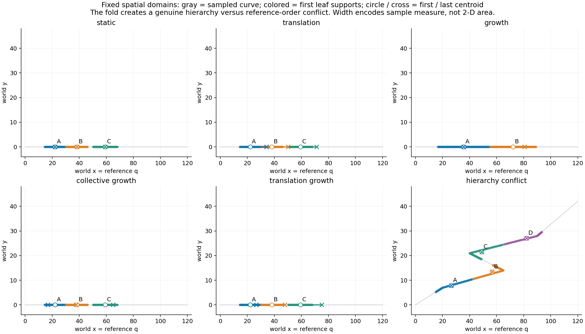
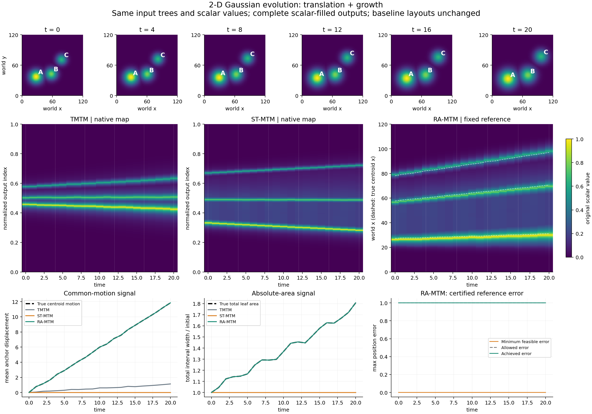
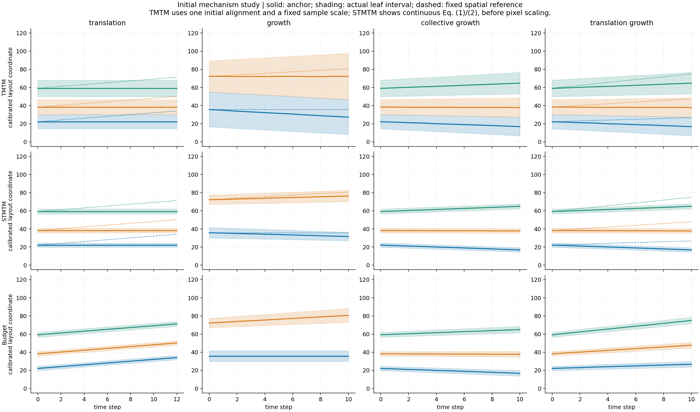
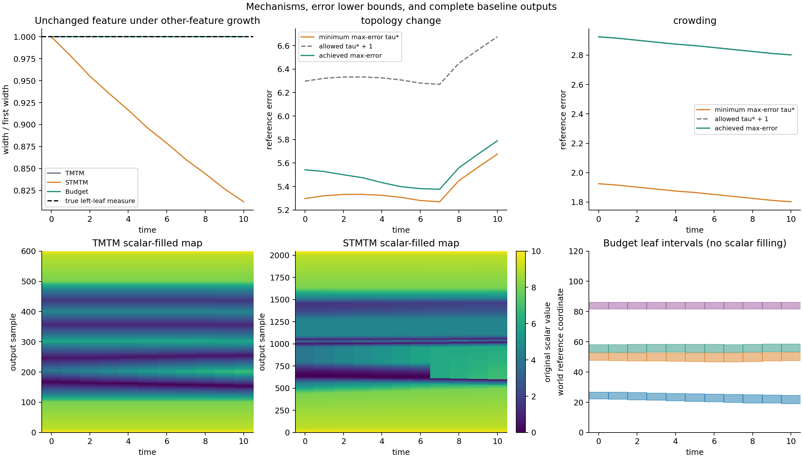

# 初版实验报告

更新：2026-09-18。阶段：方法初版与研究动机验证；追加二维高斯场与完整三方法时序图。

**本轮结论：现有方法确实缺少对共同空间位移和绝对特征量的显式保持；引入固定空间参照、绝对宽度和参照运动残差后，在实际标量场生成的受控实验中获得了清晰改进。**进一步用层次可行域内的最小位置误差下界组织布局，可以把不可避免的失真变成可解释的预算。初版已有继续研究的价值；核心依据是机制推导、正确 baseline、受控结果及消融，而非让 baseline 在非法输入上失败。

本轮重新阅读本地两篇 PDF 的方法、公式、流程和图示，并补查论文1公开源码。活动目录只保留本报告一份说明文档。旧文档、代码和结果均打包保留，未销毁原始数据。

## 1. 研究问题与实验目的

研究问题是：**如何在保持特征层次和区间合法性的同时，让时序图中的位置、位移和宽度分别具有固定空间位置、真实投影运动和绝对量变化的语义，并在这些要求冲突时显式控制失真？**

逻辑链如下：

1. TMTM 把完整样本与拓扑层次放进一维，用子树重叠误差保持时间连贯性；它没有要求布局坐标等于某个固定空间参照。
2. ST-MTM 增加几何距离与相对尺寸，但距离矩阵不能识别共同平移，固定总宽度不能识别共同规模变化；旧位置时间惩罚偏好“不动”，不区分真实运动与布局抖动。
3. 当前任务要求读者判断“是否真的移动”“谁真的增长”，因此需要补充被上述编码消去的信息。
4. 本文用固定参照 q、绝对测度宽度和真实运动残差补充这些信息；再求层次兼容条件下的最小最大误差 τ*，以 τ*＋额外预算控制布局。
5. 初版首先验证共同平移、单特征增长、共同增长和两者组合；然后验证真实层次变化下，改进能否继续成立且可解释。

本报告包含两个连续阶段：原始一维／折线实验验证区间骨架；新增二维高斯实验完成**原场→真实合并树→三种完整标量时序图**。本文方法现命名为 **RA-MTM（Reference-Anchored Merge Tree Maps，参照锚定合并树图）**。其完整图复用核验过的 ST-MTM 层次填充器，创新仍在布局及编码机制，不把借用的填充算作原创。这不是完整系统的全面排名，也不是端到端真实数据性能评测。

本轮没有必要把“适用条件被破坏”作为证明优势的前提。主实验刻意使用两篇论文都可合法处理的数据，直接揭示表示机制缺少的信息；缺输入和退化参数只作为适用性核查。

## 2. 两篇参考方法及其适用条件

原文为本地保存的论文1与论文2 PDF（PDF 不上传），来源与哈希见 [provenance.json](papers/provenance.json)。编号始终对应这两份本地版本。论文2为所提供的 2026 年预印本；不把推导出的代码称为官方实现。

| 方法 | 解决的问题 | 主要输入与结构要求 | 没有显式保证的语义 |
|---|---|---|---|
| TMTM | 保留全部样本与 merge-tree 拓扑，并使相邻帧的子树重叠关系相近 | 每帧完整增广树；可比较的原空间样本域；Algorithm 1 使用二叉内部节点及单根弧；regular nodes 按标量方向有序 | 固定世界位置、真实共同位移；保留样本数量不等于静止特征锚点不漂移 |
| ST-MTM Base | 层次约束下保持相对距离、邻近关系与特征相对尺寸 | 叶层次、叶重心与大小；完整填充还需 scalar values 和增广弧；δ>0、K>0、α>0 | 距离决定布局到平移／反向规范为止；不保证绝对位置和绝对量跨时刻可比 |
| ST-MTM Temporal | 在 Base 的基础上加入跨帧排序与位置连贯性 | 额外可提供叶对应；不要求所有叶都匹配，不要求树结构或特征数恒定 | 旧位置惩罚不等于真实运动误差；低 TD 不等于运动被正确表达 |

**需要纠正的适用性理解：**共同平移、增长、非共线几何和层次变化都不自动使 baseline 非法。论文1允许拓扑随时间变化；论文2明确讨论层次改变、未匹配叶和特征数变化。多鞍点也不能一概称为论文1不能处理：原文描述了二叉化预处理；本 Python 后端未实现该步骤时，应报告“需要预处理／本实现尚不支持”，而不是伪造拓扑等价保证。

本文也需要可信的层次、测度和空间参照。真实运动残差需要跨帧特征对应；本轮用已知身份隔离匹配误差。位置约束表达的是**固定方向上的投影位置**，不声称一个一维坐标能够恢复完整二维运动。

## 3. 两个 baseline 的代码复现核验

正式执行入口是 [TMTM 实现](baselines/temporal_merge_tree_maps.py) 和 [ST-MTM 实现](baselines/spatiotemporal_merge_tree_maps.py)。旧代理不再参加本轮主比较。

论文1还交叉核对了[作者仓库](https://github.com/Wiebke/TemporalMergeTreeMaps)，固定提交 `2c75a10ed2cd55177a25ff751e0c0a8261200717`，检查 `mergetreemaputils.cpp` 的 `objectiveForSeveralArcs`、`decideGreedy`、`decideGreedyTree` 和优化处理器默认设置。参考源码及其许可保存在 `archive/paper1_author_reference.zip`，来源与 PDF 哈希保存在 [provenance.json](papers/provenance.json)。这不是编译运行作者 Inviwo 系统；是对照原文和公开实现核验 Python 复现。

| 原文步骤 | 本轮执行代码 | 核验方式 |
|---|---|---|
| 论文1 Algorithm 1、图4：根在左端，弧外向内交替，鞍点在两子树之间 | `linearize_tree` | 手算七样本映射；逐样本双射；所有子树区间连续 |
| 论文1 式(1)：原空间子树交集点数 | `spatial_overlap_matrix` | 独立布尔成员计数核对，不以 Jaccard 代替 |
| 论文1 式(2)–(4)：平方交集误差、闭区间交集 | `objective_between`、`interval_overlap` | 端点相接计一个样本；完整非根子树对参与 |
| 论文1 §3.2.2：自顶向下局部贪心，Start 双向传播 | `_greedy_align_one_tree`、`optimize_temporal_order` | 对照作者 C++ 的两个子分支局部贡献；平局保留原顺序；正式实验不再以全排列全局最优冒充贪心 |
| 论文2 §4.1.1：OLO、bottom-up concordance、r 阈值、正反方向 | `optimal_hierarchical_leaf_order`、`temporally_concordant_order`、`choose_temporal_order` | 小树枚举仅用作独立 OLO 最优成本核查，不替代论文的执行流程 |
| 论文2 式(1)：加权距离应力＋旧位置时间项 | `project_leaf_anchors` | 共线解析解、最小间隔、共同平移不变性；无原文不存在的画布硬边界 |
| 论文2 式(2)：相对目标宽度与包含／分离／总宽度 | `allocate_leaf_intervals` | 可行零误差解析宽度、极小 K、逐约束检查 |
| 论文2 §4.1.3：共享尺度、padding、舍入和空隙 | `discretize_skeletons` | 使用全序列范围；离散后检查全部邻接间隔，不逐帧拉伸 |
| 论文2 图4、图5A–D：叶、兄弟、direct–deep、deep–deep、边界填充 | `fill_leaf_intervals`、`fill_internal_gap`、`fill_boundaries` | 本轮包含相应树结构；完整输出重新提取树后核对分支层次、叶极值和合并标量值 |

论文2没有独立编号伪代码，核验对象是 §4.1–4.3 的文字算法、式(1)(2)、图3–5；没有把普通 MDS、直接投影或旧 TMTM 代理当成论文2方法。排序代价按实际相邻对求和，避免公式排版中最后索引越界。

**明确的复现假设：**

- 本轮标量场是已知固定线／折线上的分段线性函数，规则一维 sweep 提取树，不进行持久度简化；这不等于复现作者的 TTK 真实数据预处理。
- ST-MTM 的 δ、α、SLSQP 初值／容差、无锚定时的平移规范，以及严格不等式的数值余量均显式配置；不是声称原文报告了这些默认值。
- 全部主实验向论文2和本文提供同一组真实身份对应；论文2允许外部对应输入。模块自带 Hungarian overlap matching 是复现假设，本轮不靠匹配错误制造差异。
- 论文只规定从 regular nodes 均匀采样；本实现用等距索引＋最近节点取样。重复样本合法，tie-to-even 舍入是实现约定。
- sibling quadratic interpolation 使用端点保持的 t²，空 regular arc 的端点插值、路径尺寸取整和离散冲突修补规则均属复现假设。原文没有给出足以唯一确定这些细节的信息。
- 0/0 排序成本比未定义时保留 concordant 顺序；不声称该平局策略来自官方代码。

## 4. 当前 baseline 实现发现的问题与修正

| 原问题 | 原因 | 修改方式 | 修改后的结果／证据 |
|---|---|---|---|
| 旧 `fig2_fig7_controlled` 将人为间隔的 hierarchy proxy 用作论文1曲线 | 间隔 5/25 来自人工设计，不是 Algorithm 1 与 overlap 优化 | 从主比较移除，改调核验后的真实 TMTM 贪心 | 新主实验由完整样本生成；TMTM 在静止／平移控制中的距离 NRMSE 约0.0112，未被人为做差 |
| 旧三叶高斯图与人工树、`100(σ/8)²` 量代理混用 | 绘图场未用于提取树，尺寸也不是真实叶弧大小 | 新数据从实际标量场提树，所有叶重心／量从弧样本计算 | 每个输入 NPZ、树 JSON、样本映射和输出可回溯 |
| 旧最小实验使用小树全排列求最优作为论文1结果 | 是目标算子验证，不是原文贪心算法 | 保留旧结果归档；主实验改回原文贪心，全排列只作独立检查 | 正式结果与算法名一致 |
| 一组旧 ST-MTM 骨架投影添加 `[0,120]` 硬边界 | 原文式(1)只有排序最小间距，没有该画布约束 | 主实验直接调用无额外边界的式(1)，随后全局尺度装配 | 不把本文的画布限制强加给 baseline |
| 逆距离权重在 d=0 时静默置0 | 把无定义的 1/d 变成“忽略该对” | 逆距离模式明确拒绝；uniform 模式继续合法求解 | `verification.json` 保存两种模式的回归结果，未将整个 ST-MTM 判为不可用 |
| 离散修补只看当前邻接对 | 后续左移可能破坏已经修好的空隙 | 保持舍入区间长度的前向／后向修补，加全局容量与间隔检查 | 4个单点区间、5像素的反例，旧代码返回 `[0,1,2,4]`；新代码指出至少需7像素 |
| “均匀采样”实际用线性插值生成新标量 | sampling 与 interpolation 混淆 | 叶／路径采样改为选已有值，明确插值仅出现于规定／假设的位置 | `[0,10]` 取3点由旧 `[0,5,10]` 改为 `[0,0,10]`；不是捏造5 |
| 式(2)“可行初值”仍可能重叠，固定余量可能误伤极小K | 补足宽度后重新居中；数值尺度不匹配 | 内侧小余量、剩余宽度放外侧；余量随K、最小目标宽度和间距自适应 | K=1e-8 的合法案例通过；每次解均核查包含、分离和总宽度 |
| 完整填充剩余 NaN 被全局插值掩盖 | 将流程遗漏伪装成成功图像 | 填充后不完整即报错 | 当前全部 baseline 标量输出有限且通过拓扑核查 |
| TMTM 未二叉化时仍给出常规输出 | 可映射样本不代表二叉拓扑等价保证成立 | 在正式线性化入口要求合法二叉输入，未处理多鞍点明确拒绝 | 不冒充已实现论文的多鞍点预处理；不宣称原论文完全不能处理 |
| 树输入缺少全局所有权检查；TW 重合点可能把自身排入邻域 | 局部校验不足、距离平局 | 验证连通／无环／唯一样本归属；TW 显式将自身置首 | 非法输入不进入优化；邻域指标避免自邻居错误 |
| 本文首帧平移自由度导致无意义偏移 | 预算内主目标仍对共同平移不敏感 | 在不改变目标与约束的可行平移范围内，选择最接近参考均值的规范 | 静止控制位置 MAE 从探索运行约0.6419降至小于1e-6 |
| 本文 τ=τ*、ρ=0 时 SLSQP 偶发误报不可行 | 可行域位于低维面，重复活跃约束导致数值退化 | 消去 z=x；必要时用LP找恒紧约束，在可行面的零空间求同一QP | 81组参数扫描通过；没有放宽预算或缩小绝对宽度 |

历史真实数据结果不作为本轮证据：ERA5 的脚本使用 h-minima、二维8邻接及每帧范围解释，不能等同于作者 TTK 简化；论文1的原始网格宽度也与已下载数据有差异。论文2 `p_opt=0.105` 被解释为每帧10.5%且据特征数吻合自证正确，证据不足。上述脚本和旧图均归档为历史探索版本，不把它们重新贴成已修正的官方复现。真实数据方法一致性属于下一阶段的专门工作。

## 5. 我的方法与创新点

**方法名称：RA-MTM — Reference-Anchored Merge Tree Maps（参照锚定合并树图）。**这是当前工作的命名，未作名称独占性或文献首创断言。名称突出固定真实空间参照；绝对量编码、运动残差和可行域误差预算是其配套机制。历史结果中的 `Budget`／“本文预算方法”均指同一个布局核心。完整输出入口为 [reference_anchored_merge_tree_maps.py](methods/reference_anchored_merge_tree_maps.py)。

代码：[error_budget.py](methods/error_budget.py)。保留既有原型的研究思路，去掉硬编码三叶与代理 baseline，改为真实层次输入、小树合法序枚举和独立可行性证书。

设特征质心为 Cᵢᵗ，固定参考 `qᵢᵗ=Cᵢ,xᵗ`，绝对测度为 Aᵢᵗ；x 为特征锚点，z 为色带中心。全时间使用同一比例 `wᵢᵗ=cAᵢᵗ`。

先求：

\[
\tau_t^*=\min_{\pi,x,z}\max_i|x_i-q_i^t|.
\]

约束：π 是真实树的合法叶序；区间不重叠且间隔至少g；区间位于画布内；`|xᵢ−zᵢ|≤ρwᵢ/2`。本轮默认ρ=0.5，锚点处于区间内部。

再在 `|xᵢ−qᵢ|≤τ*＋Δ` 内优化：

\[
\sum_{i<j}(|x_i-x_j|-\|C_i-C_j\|)^2
+\lambda\sum_i[(x_i-x_i^{prev})-(q_i-q_i^{prev})]^2
+\eta\sum_i(z_i-x_i)^2.
\]

固定合法序时距离绝对值可消去，因此是凸二次目标与线性约束。首帧不加时间项；首帧自由平移按参考均值选规范。逐帧枚举合法序，先取最小LP下界，再求满足预算的QP。没有将上一帧排序硬锁定，也没有声称求得整个序列全局最优。

**核心候选贡献是一个联合表示协议：**

- 用固定参照补回距离矩阵不包含的共同位移信息。
- 用绝对量宽度去掉跨特征归一化耦合，使“别的特征增长”不会改变当前特征的绝对编码。
- 用真实运动残差替代“越不动越好”的时间目标，避免在合法预算内无意义地滞后真实运动。
- 用可计算的最小误差下界和额外预算组织层次冲突，而不是只给一个难解释的参考权重。

单独绘制质心或绝对宽度不是足够的新颖性主张；研究价值在于它们与**层次兼容、合法区间及可解释失真预算**的联合。当前证据支持继续研究这一问题，不等同于已证明文献首创。

### 5.1 新增完整标量输出

在 RA-MTM 连续区间确定后，用全时间固定映射 `pixel=round((L−1)x/120)` 离散化锚点及区间端点，再调用已审计的 ST-MTM `fill_frame`，从**实际叶弧和内部弧标量**采样、按层次填充间隙与边界。没有重画人工高斯色带、没有给 RA-MTM 单独提高峰值，也没有逐帧归一化位置或宽度。像素容量不足直接报错；本轮无需修改连续解或修补间距。

这是明确借用的下游渲染组件，**RA-MTM 的布局不是 ST-MTM 式(1)/(2)**。输出是一维树结构摘要，不是二维原场的可逆重建。连续绝对宽度精确编码离散面积；像素宽度另有量化误差，不能混淆。本次2048像素的RA-MTM锚点最大量化误差为0.02924世界单位、区间端点跨度误差最大0.05329；表中的运动MAE取连续解，不能把机器零误读为像素轨迹也完全无误差。新增测试从三种输出标量图重新提取 split tree，逐帧核对叶极值、分支成员及合并标量值，而非只检查输入树或区间。

## 6. 构造数据设计

### 6.1 共同生成约定

生成器：[datasets.py](experiments/initial/datasets.py)。源参数域为 `s=0,0.2,…,120`，601个固定样本，邻接始终为 `(i,i+1)`。每帧通过指定控制点的分段线性插值得到真实标量值；用一维 join-tree sweep 提取增广树。

直线场嵌入为 `(s,0)`。折线场嵌入为 `(h(s),0.35s)`，其中 h 在 `(0,0),(20,20),(40,65),(60,40),(80,90),(120,120)` 间分段线性插值。y 随 s 严格递增，因此折线不会因x回折而把源样本混同；其几何坐标全时间固定。

叶特征按源参数中的极小值身份对应；本轮没有出生／消失。C 是叶极值＋该叶弧 regular nodes 的等权平均坐标，A 是其真实样本数量。**A 是样本测度，不是二维面积；折线采样也不是等弧长测度。**实际面积或体积需要下一阶段的物理权重，不能把本轮结论直接改写成已验证二维面积守恒。

### 6.2 从机制控制到复杂层次

| 数据 | 生成方式与控制量 | 对应问题与预期现象 | TMTM / ST-MTM 条件 | 本文仍适用的原因 |
|---|---|---|---|---|
| D0 静止 `static`，13帧 | 三叶模板完全不变 | 正控制：正确方法不应凭空产生可见运动 | 均满足完整方法条件 | 输入、参考和可行域均不变 |
| D1 整体平移 `translation`，13帧 | 三叶模板的7个内部控制点每帧向右移动1；域端点固定 | 隔离共同位移；树和叶量不变，距离不变，参考每帧＋1 | 均满足；不是非法输入 | q 显式随真实平移改变；绝对宽度固定 |
| D2 单侧增长 `growth`，11帧 | 控制点 `(0,10),(15,7),(25,0),(55,6),(85,.5),(90+2t,7),(120,9)` | 左叶不变，右叶从背景获得样本；检验归一化导致的假收缩与静止特征漂移 | 均满足；右叶质心随非对称增长移动，未假称其静止 | 使用实际测得的q与A，独立编码各特征 |
| D3 共同增长 `collective_growth`，11帧 | 三叶模板内部横坐标变为 `40+(1+0.03t)(s−40)` | 全部叶量约同比增长；固定K的份额编码近乎不变 | 均满足；几何距离也扩张，但目标宽度保持可行 | 绝对量变化保留，运动参照按实际质心计算 |
| D4 平移＋增长 `translation_growth`，11帧 | D3内部控制点再整体加t | 验证两种改进能同时成立，而非只修好一个孤立公式 | 均满足 | q包含平移与扩张，A独立更新 |
| D5 静态层次冲突 `hierarchy_conflict`，11帧 | 四叶标量模板置于上述固定折线；树为 `((A,B),(C,D))`，参考次序为A–C–B–D | 直接按q排列不能满足层次；需非零τ* | 两个baseline仍合法，不能将“与q冲突”说成其输入假设被破坏 | 本文允许预算内调整，并给出最低必要误差 |
| D6 真实层次变化 `topology_change`，11帧 | 四叶模板s=30的鞍点由4增至7，其余控制值不变 | 真正从标量场提取出层次变化；验证时间与量编码的组合改进 | 均满足；ST-MTM执行concordance和重排阈值 | 每帧重新生成合法序和τ*，沿已知身份计算残差 |
| D7 拥挤 `crowding`，11帧 | 两谷位置25+t、95−t，中央鞍点60；嵌入 `(55+s/12,0.4s)` | x投影狭窄但原空间距离较大；验证预算可解释性和合法输出 | 均满足 | 对区间冲突给出正τ*，不靠重叠伪造零误差 |
| D8 摘要输入 `summary_only`，11帧 | 由D6仅导出C、A、层次；不提供标量样本和增广弧 | 检查实际输入边界，不承担主优势结论 | TMTM完整遍历缺输入；ST-MTM骨架可定义，完整填充缺输入 | 本文当前输出是骨架，所需信息已齐全 |

三叶模板内部控制点为 `(10,7),(20,0),(30,4),(40,.5),(50,6),(60,1),(70,7)`，外侧端点为 `(0,10),(120,9)`。四叶模板为 `(0,10),(10,8),(20,0),(30,4),(40,.5),(50,6),(60,1),(70,4.5),(80,1.5),(90,8),(120,9)`。D6改变s=30的标量值，不直接指定树。

D1叶量全程为78、81、91。D2左叶全程192，右叶171→255。D3/D4的增长存在采样取整差异，因此以导出的实际叶量计算比值，不把理论连续比例硬写进结果。




### 6.3 仅用于正确性的边界检查

另有三个微型算子检查：重合质心时 inverse 权重无定义但 uniform 仍可运行；4个单点离散区间若要求3个空隙至少需要7像素；本文两个宽度6加间隔0.5无法放入长度5画布。它们不参与主方法排名，不被用于宣称“所有方法都会失败”。细节见 [boundary_checks.csv](results/initial/boundary_checks.csv) 与 [verification.json](results/initial/verification.json)。

### 6.4 二维高斯场：与论文2图示相近的数据形式

这是受截图启发的**独立构造数据**，并非声称重建论文2未公开的原始数据。三个光滑高斯峰的上包络形成时变二维标量场；不用预设树、手写重心或手写面积替代提取结果。

固定域 Ω=[0,120]²，65×65 规则网格，共4225样本；21帧，t=0,…,20。定义

\[
f_t(x,y)=\max_{i\in\{A,B,C\}} a_i\exp\!\left(-\frac{\|(x,y)-\mu_i(t)\|^2}{2\sigma_i(t)^2}\right).
\]

`a=(1,0.8,0.65)`，初始 `μ=((27.3,36.7),(57.7,42.3),(78.1,70.9))`，`σ=(9,8,7)`；中心 `p=(55,50)`，`μ_i(t)=p+s(t)(μ_i(0)−p)+(u(t),0)`，`σ_i(t)=s(t)σ_i(0)`。使用最大值而不是求和，以清楚控制三个峰，且不引入叠加造成的峰合并混淆；原场和三种输出都用固定 viridis 色标[0,1]。

| 组 | 控制变量与生成方式 | 研究问题／预期现象 | TMTM条件 | ST-MTM条件 | RA-MTM适用原因 |
|---|---|---|---|---|---|
| G1 平移 | u=0.6t，s=1 | 形态整体移动但相对距离近似不变；距离布局应缺少共同位移信号 | 满足：同一网格、完整增广二叉树 | 满足：完整树、重心、叶量、对应、标量 | 固定世界x参照直接感知移动；所需宽度可装入画布 |
| G2 增长 | u=0，s=1+0.015t | 围绕固定中心扩张，叶区域面积增加；固定K不表达总量增长 | 满足 | 满足 | 用实际离散支持面积编码宽度，不用全帧总量归一化 |
| G3 平移＋增长 | u=0.6t，s=1+0.015t | 同时保留“移动多少”和“增长多少”；作为主展示图 | 满足 | 满足 | 同时输入真实参照、面积和层次，且预算／非重叠约束可行 |

所有场景都从二维场实际提取 **split tree**（高值峰），邻接沿用已核验的 Freudenthal 网格后端；没有做为某方法服务的单独简化。本轮每帧确有三个叶、二叉内部节点。叶特征是极大值加其叶弧正规样本；重心为这些样本坐标平均，**面积 A=样本数×(120/64)²**。这是离散叶支持面积，不是高斯σ、固定阈值区域面积或强度积分。均匀网格下用面积或样本数计算 ST-MTM 相对比例等价。

身份通过提取出的峰与已知生成峰中心做一对一最近匹配，三个方法使用同一对应；生成中心只用于匹配和解释控制变量，参考q及面积均从叶支持重新计算。所有输入NPZ、树弧JSON和生成参数在本地保存于 `data/constructed/gaussian2d`，不上传；目录约定见 [数据说明](data/README.md)。离散采样与鞍点变化意味着“连续模板纯平移”下离散支持量也可能小幅变化，因此真值使用实测支持，而不强设面积不变或位移恰为12。

## 7. 初版实验设置

| 设置 | 取值与理由 |
|---|---|
| TMTM | 原文贪心；Start=0；601个样本全部保留，不下采样；原始样本坐标固定乘120/600，仅首帧做一次共同平移均值对齐 |
| ST-MTM | Temporal；uniform；λ=0.5；r=0.95；δ=0.01；α=1；每场景K=0.06×首帧总叶量，随后固定；完整图长2048；Start=0 |
| 本文 | 画布[0,120]；c=0.06；g=0.5；ρ=0.5；额外预算Δ=1；λ=0.5；η=0.1 |
| 对应 | 主实验所有方法的特征身份同源且已知；TMTM优化本身不使用身份匹配 |
| 输出评价 | TMTM按固定样本尺度，ST-MTM按连续式(1)(2)，本文按固定参考尺度；另单独保存baseline的完整像素输出 |
| 数值 | LP用HiGHS；QP用SLSQP与解析梯度；本文目标除1000仅改善条件数；误差小于1e-4不作视觉优势解读 |
| 环境 | Python 3.9.24，NumPy 2.0.2，SciPy 1.13.1，Matplotlib 3.9.4 |

这些是构造实验参数，不冒充原文某个真实数据预设。没有通过逐帧平移、逐特征对齐、逐帧缩放或额外画布约束把baseline变差。不同编码的绝对宽度单位不同，所以跨方法尺寸比较使用相对首帧的变化比例。

**指标：**位置 MAE=`mean|x−q|`；运动 MAE=`mean|Δx−Δq|`；色带运动用z替代x；尺寸比例 MAE=`mean|w_t/w_0−A_t/A_0|`；距离 NRMSE=`sqrt(Σ(d_layout−d_world)²/Σd_world²)`。另记录SNS、静止特征最大漂移、层次违规、区间重叠、偏心、τ*和预算约束余量。尺寸比例误差是比值差，不直接称为百分比误差。SNS会消去总体尺度，尤其两特征时可能为0，不能代替固定尺度距离和运动指标。

正控制、所有有效帧和反例均保留；不按“只有本文通过”的事后阈值筛选结论。实验为确定性机制验证，不作统计显著性声明。

### 7.1 二维追加实验设置

入口：[experiments/gaussian2d/run.py](experiments/gaussian2d/run.py)。三组使用同一套参数，未逐场景调参。RA-MTM 使用画布120、面积比例c=0.012、gap=0.5、ρ=0.5、Δ=1、λ=0.5、η=0.1。ST-MTM 使用 uniform 距离权重、r=0.95、λ=0.5、α=1、δ=0.01，固定 `K=0.012×首帧实际总叶面积`；ST-MTM 和 RA-MTM 均用2048像素填充，TMTM保留论文全样本语义，输出4225样本。这是机制验证，未冒充相同输出预算的系统公平评测。

**坐标约定不能暗中改变。**TMTM样本坐标用固定 `120/(4225−1)` 标度作诊断；ST-MTM使用归一化前的物理距离坐标。两个baseline均只在首帧选择一次整体方向及平移对齐，之后不逐帧对齐。完整热图则展示各自原生输出，baseline纵轴明确为“normalized output index”，RA-MTM为固定world x；不能把它们当成三幅已共享物理纵坐标的图。运动和面积比例结论不依赖该首帧平移。

复用运行器时修正了旧 `run_b1` 把601个一维样本写死的尺度：现在从实际树样本数计算尺度，一维原结果不变。`run_b2`新增显式参数入口，公式、约束、排序和填充均未修改。图像没有对baseline单独平滑、裁切、隐藏曲线或逐帧重缩放。

## 8. 实验结果

### 8.0 新增主展示：二维原场与三种完整时序图



[查看动态图](results/gaussian2d/translation_growth.gif)；[仅平移对照](results/gaussian2d/translation_comparison.png)；[仅增长对照](results/gaussian2d/growth_comparison.png)；[实际叶支持与区间中间结果](results/gaussian2d/translation_growth_intermediates.png)。

| 场景 | 方法 | 运动MAE | 尺寸比例MAE | 位置MAE | 距离NRMSE |
|---|---|---:|---:|---:|---:|
| G1 平移 | TMTM | 0.5987 | <0.0001 | 15.6116 | 0.7716 |
| G1 平移 | ST-MTM | 0.6020 | 0.0222 | 7.9755 | 0.0364 |
| G1 平移 | RA-MTM | <0.0001 | <0.0001 | 1.0000 | 0.1975 |
| G2 增长 | TMTM | 0.1684 | <0.0001 | 14.6351 | 0.7336 |
| G2 增长 | ST-MTM | 0.1025 | 0.3815 | 6.3490 | 0.0362 |
| G2 增长 | RA-MTM | <0.0001 | <0.0001 | 1.0000 | 0.2033 |
| G3 平移＋增长 | TMTM | 0.5359 | <0.0001 | 16.5935 | 0.7308 |
| G3 平移＋增长 | ST-MTM | 0.5922 | 0.3810 | 8.3964 | 0.0362 |
| G3 平移＋增长 | RA-MTM | <0.0001 | <0.0001 | 1.0000 | 0.2031 |

**最直接的证据是两种信号同时保留。**G3从首帧到末帧，实测叶重心平均横向位移为11.8442；TMTM为1.1269，ST-MTM约0，RA-MTM为11.8442。真实总叶面积变成1.8069倍；TMTM与RA-MTM的总区间宽度也为1.8069倍，ST-MTM因固定K保持1倍。G1真实平均位移12.0405，RA-MTM完整保留，ST-MTM约0；G2真实总叶面积增长至1.7414倍，RA-MTM与TMTM保留，ST-MTM为1倍。这支持“补回共同位移并保留绝对量”的联合研究动机，**不支持“TMTM不能编码量增长”**。

RA-MTM本组三个锚点的参考误差分别处于固定±1预算边界，因此位置MAE=1，而跨帧误差残差几乎不变，运动MAE接近机器零。这来自所设计的约束与场景，不是独立证明复杂时间正则必要；其必要性仍应在有噪声／层次变化消融中检验。固定x投影也不保全二维距离：G3 ST-MTM的距离NRMSE为0.0362、RA-MTM为0.2031。[配套stress曲线](results/gaussian2d/geometry_stress.png)保留这一差异。应把优势限定为研究任务要求的空间参照和绝对量语义，不写成全指标优胜。

**完整输出验证：**三组×21帧×3方法，共189幅标量输出，重新提树后的叶极值、分支成员和合并值核对全部通过；RA-MTM所有帧区间非重叠、叶序合法且满足误差预算，并验证离散锚点处确实取原叶极值。重复采样产生的连续等值平台先取商后比较，未使用持久性阈值删掉真实峰。这是本批数据的实证检查，尚非一般拓扑保持定理。

数值、逐特征轨迹、三套中间结果、像素量化误差和验证表均在 [results/gaussian2d](results/gaussian2d)，具体见 [metrics.csv](results/gaussian2d/metrics.csv)、[topology_checks.csv](results/gaussian2d/topology_checks.csv)、[validation.json](results/gaussian2d/validation.json)。以下保留前一阶段一维／折线实验作为机制及消融补充，不与二维数据混算。

### 8.1 主要机制改进

| 场景 | 方法 | 位置 MAE | 运动 MAE | 尺寸比例 MAE | 距离 NRMSE |
|---|---|---:|---:|---:|---:|
| 整体平移 | TMTM | 6.0120 | 1.0000 | 0.0000 | 0.0112 |
| 整体平移 | ST-MTM | 6.0000 | 1.0000 | 0.0000 | <0.0001 |
| 整体平移 | 本文预算方法 | <0.0001 | <0.0001 | 0.0000 | <0.0001 |
| 单侧增长 | TMTM | 4.2636 | 0.8400 | <0.0001 | 0.0018 |
| 单侧增长 | ST-MTM | 2.0955 | 0.4200 | 0.1164 | 0.0048 |
| 单侧增长 | 本文预算方法 | <0.0001 | <0.0001 | <0.0001 | <0.0001 |
| 共同增长 | TMTM | 0.1646 | 0.0367 | <0.0001 | 0.0104 |
| 共同增长 | ST-MTM | 0.0634 | 0.0473 | 0.1517 | 0.0041 |
| 共同增长 | 本文预算方法 | <0.0001 | <0.0001 | <0.0001 | <0.0001 |
| 平移＋增长 | TMTM | 5.0323 | 1.0033 | <0.0001 | 0.0100 |
| 平移＋增长 | ST-MTM | 5.0061 | 0.9967 | 0.1513 | 0.0041 |
| 平移＋增长 | 本文预算方法 | <0.0001 | <0.0001 | <0.0001 | <0.0001 |

**整体平移：**真实每个特征最终移动12。TMTM和ST-MTM的布局没有恢复这一共同位移，运动MAE均为1；本文约6.5×10⁻⁷，属于数值零。ST-MTM在该例的距离应力也为零，恰好说明“距离正确”和“运动正确”是不同信息。

**单侧增长：**未增长的左叶A始终192个样本，TMTM与本文的末／首宽度比均为1；ST-MTM为 **0.8120805**，表观缩小约18.79%。这与 `363/447` 完全对应，来自总叶量变化的分母。本文同时将静止A的布局漂移压到数值误差；TMTM约8.4，ST-MTM约4.098。

**共同增长：**A真实量增长到首帧的 **1.3076923** 倍，本文和TMTM宽度同步增长；ST-MTM为 **0.9997648**，几乎看不出总量增加。微小非零差异来自网格采样后的份额变化，不是共同增长被恢复。

**平移＋增长：**本文位置与运动误差均小于1e-4、尺寸比例误差为数值零；TMTM保留量但运动MAE约1.0033，ST-MTM运动MAE约0.9967且尺寸比例误差约0.1513。该组合实验验证了两个机制可以同时发挥作用。



### 8.2 真实层次变化下的改进

| 场景 | 方法 | 位置 MAE | 运动 MAE | 尺寸比例 MAE | 距离 NRMSE |
|---|---|---:|---:|---:|---:|
| 真实层次变化 | TMTM | 7.6637 | 0.0868 | <0.0001 | 0.3379 |
| 真实层次变化 | ST-MTM | 3.5805 | 0.0764 | 0.0620 | 0.1263 |
| 真实层次变化 | 本文预算方法 | 3.6293 | 0.0349 | <0.0001 | 0.1263 |

相对ST-MTM，本文运动MAE从0.076410降至0.034918，降低约 **54.3%**；尺寸比例误差从0.061984降至数值零。距离NRMSE从0.126295到0.126338，基本相当，位置MAE从3.5805到3.6293略增。这里的研究价值是**在保持合法层次与近似相同几何质量的同时，提高运动与量语义**，不是声称所有指标都最优。

D5–D7中τ*>0，说明在相同区间／层次约束下，直接令x=q不可行；本文仍能输出合法区间并给出误差预算。这使方法不局限于前述可以直接绘制质心的简单控制。



### 8.3 模块消融

所有消融使用同一合法序枚举、LP预算和求解流程，只改变指定机制，16组结果完整保存在 [ablation.csv](results/initial/ablation.csv)。

| 改动 | 观察 | 支持的结论 |
|---|---|---|
| Full→RelativeWidth：恢复固定K的相对宽度，其余保留 | D2尺寸比例误差回到0.116426，D3回到0.151659 | 真实参照不能代替绝对量编码；消除归一化耦合是独立收益 |
| Full→OldTime：仅把真实运动残差换回旧位置惩罚 | D1位置MAE约0.9231、运动MAE0.08333；D4运动MAE0.1 | 在有额外位置预算时，旧时间项会利用预算产生不必要的运动滞后 |
| Full→NoTime：去掉时间项，保留参考与绝对量 | 简单确定性场景也能达到近零误差 | 本轮已证明残差项优于错误的静止惩罚；尚未证明它在这些简单场景中优于完全不加时间项 |

因此，最坚实的核心证据是**真实参照＋绝对量＋层次误差预算**。时间残差有明确正确语义，但其相对“无时间项”的额外平滑收益应在后续噪声与复杂运动任务中继续验证；不为了维持复杂模型而夸大消融。

### 8.4 稳定性与计算正确性

- 8组完整标量数据共92帧，两套baseline均生成完整输出。TMTM所有样本映射为双射且子树连续。
- 92帧均重新提取输出树，核对分支叶集合、叶极值和合并标量值。ST-MTM重复取样形成的平台先按相邻同值商空间处理，避免SoS零持久度伪极值污染比较；并非在输出上额外做持久度简化。
- 117项解析／回归检查通过，结果见 [verification.json](results/initial/verification.json)。这些是测试项数量，不是117个独立统计样本。
- 本文9组、103帧骨架全部合法。最差约束余量约−7.1×10⁻¹⁵，属于浮点误差；选中QP的最大凸目标间隙上界约0.000519，小于0.01检查阈值。该间隙证书针对选中顺序的连续QP，不单独构成全部离散序的统一最优性证书。
- 对D1/D6/D7扫描ρ∈{0,0.5,1}、Δ∈{0,1,3}、λ∈{0,0.5,2}，共81组；所有输出合法且遵守其预算。
- 再对这3组数据做σ∈{0.01,0.1,1}、种子0–4的质心高斯扰动，共45组；本次没有改变叶序，最大锚点变化约2.923，预算均守住。这是骨架输入敏感性检查，不是标量场噪声和重新提树的鲁棒性验证，也不构成一般连续性定理。

## 9. baseline 失效原因分析

这里的“失效”优先指**不能完成当前分析语义**，不是代码崩溃。

**TMTM的可调自由度不足以编码共同平移。**在D1中，所有弧样本数量和树结构不变，Algorithm 1能改变的主要是兄弟翻转；优化所得顺序不变，一维锚点也不变。原空间重叠代价仍能感受到移动，不能说TMTM完全不利用空间信息，但当前布局自由度无法把该共同位移表现为共同平移。增长时，背景样本被重新分配，又会移动未增长特征的极值位置。

**ST-MTM的距离表示消去了共同位移信息。**对任意u，`Cᵢ→Cᵢ＋u`不改变成对距离、逆距离权重或OLO成本。原最优位置保持不动仍使距离项最优、时间项为0。全序列共享缩放与padding不会补回缺失的逐帧运动信号。该结论不依赖特意选择一个让baseline变差的λ。

**固定K宽度消去了共同尺度信息。**`ŵᵢ=K Aᵢ^α/ΣAⱼ^α`：别的叶增长会压低本叶份额；所有叶乘同一个正比例时目标宽度不变。本轮间距足够使相对目标宽度可行，因此观察到的效应不是错误求解或者拥挤造成的。

**输入不足必须分阶段记录。**D8中TMTM遍历缺少全域增广信息，不能定义完整输出；ST-MTM的§4.1骨架只需层次、重心和量，所以本轮仍计算其骨架并保存定量结果，只把§4.2完整填充记录为缺输入。D8的本文方法同样只交付骨架，不能据此宣称ST-MTM连骨架都不能处理，或把少用输入当作已证明的独有优势。

## 10. 我的方法当前能够解决的问题

1. 对共同平移，恢复固定方向上的真实位移，而不是只能展示相对距离不变。
2. 对一个或多个特征增长，保持绝对样本测度的跨时刻可比性；其他特征变化不再通过分母影响本特征宽度。
3. 对平移与增长同时发生的场景，同时获得运动与量语义的改进。
4. 对真实提取的层次变化，在本轮数据中保持几何质量基本相当的同时，降低运动误差并保持绝对量。
5. 当精确参考位置不能兼容层次和区间时，输出合法布局以及τ*、额外预算、实际误差和偏心，明确说明为了层次付出了多少位置代价。

建议初版论文的主张是：

> 现有拓扑遍历和相对几何表示不足以显式保持绝对运动与绝对量。基于固定空间参照、绝对测度和可行域误差预算的时序特征布局，在受控标量场实验中修复这些信息缺失，并在层次变化下获得可解释的运动与量编码改进。

## 11. 当前仍存在的问题

保留这些信息用于界定证据，不把它们替代前述研究动机和优势验证。

- 新增二维RA-MTM已完成共享层次填充并通过本批输出的独立拓扑核对；仍没有一般merge-tree identity证明。共享渲染器不自动保证任意新骨架都保拓扑，须继续验证退化、深层次和容量边界。
- 已有一维／折线的2–4特征，以及新增二维三峰离散叶支持面积验证；身份已知。尚未检验三维体积、出生、消失、分裂合并及匹配错误。新增高斯场是探索性设计，未作为独立保留测试集。
- ρ=1的参数扫描允许锚点到达区间端点，这是本文允许的偏心极限，不是ST-MTM严格包含约束的替代。
- 目前对合法叶序穷举，适合初版机制检查，不适合大树。首帧规范、每帧离散序切换及长期轨迹稳定性还需系统设计。
- 目前所有固定参数和数据均为探索性设计，没有宣称预注册。对于噪声，无时间项与残差项仍需任务导向的独立比较。

补充场景结果完整报告如下，不据此改写主机制结论：

| 场景 | 方法 | 位置 MAE | 运动 MAE | 尺寸比例 MAE | 距离 NRMSE |
|---|---|---:|---:|---:|---:|
| 静态层次冲突 | TMTM | 7.8745 | 0.0000 | 0.0000 | 0.3531 |
| 静态层次冲突 | ST-MTM | 3.6530 | <0.0001 | <0.0001 | 0.1301 |
| 静态层次冲突 | 本文预算方法 | 3.6661 | <0.0001 | 0.0000 | 0.1301 |
| 拥挤投影 | TMTM | 22.4189 | 0.1788 | <0.0001 | 1.4502 |
| 拥挤投影 | ST-MTM | 7.9619 | 0.0585 | 0.0365 | 0.0018 |
| 拥挤投影 | 本文预算方法 | 2.8635 | 0.0123 | <0.0001 | 0.5092 |

静态层次冲突中，本文与ST-MTM几何质量接近，本文位置MAE略高；拥挤场景中，本文位置和运动更贴近固定x参照，但距离NRMSE明显增加。它们体现的是目标语义和预算取舍。后续应围绕目标任务选择参考方向和预算，并把偏心／失真提示呈现给读者，而不是追求一个不可实现的“所有指标同时最优”。

## 12. 下一阶段需要补充的公平对比、真实数据和消融实验

后续仍以验证研究价值为主线：

1. **扩展已完成的二维机制验证。**在当前平移、共同增长及组合三组之外，加入局部增长、移动第三峰、层次切换与不同分辨率；固定参数后在独立构造数据验证，再扩展三维体积。
2. **建立完整系统公平比较。**三种方法共享提取／简化输入、坐标单位、身份信息、输出任务和显示预算；保留TMTM的全样本语义、ST-MTM的完整填充及其公开参数，分别报告骨架与最终像素结果。
3. **完善本文完整输出。**当前共享填充已在189幅输出上核对通过；继续研究一般层次、内部弧分配和量化误差，证明适用条件，不能由本批通过推断任意替换骨架都保拓扑。
4. **补最小必要消融。**在层次变化与有噪声运动中比较简单直接投影、最小参考排布、无时间项、旧位置惩罚、真实残差和预算版本；重点证明哪些复杂机制确有额外收益。
5. **优先真实任务。**ERA5用于区分真实运动、特征量和拓扑变化；先统一TTK／邻接／阈值含义，不继续按特征数接近论文就判定复现正确。CN-Reanalysis先明确PM2.5等目标变量及物理测度，再做任务案例。
6. **研究可扩展与可解释性。**替代叶序穷举，考察预算变化和跨帧切换；以用户任务验证“判断谁移动／谁增长”是否比仅有相对几何的图更准确。

### 复现入口与整理后的目录

从项目根目录执行：

```sh
./experiments/initial/run_all.sh
# 新增论文2风格的二维高斯实验（含三组完整图和动态图）
python experiments/gaussian2d/run.py
python experiments/initial/finalize.py
```

脚本默认使用本机已存在的 `python`。也可设置 `PYTHON_INITIAL=/absolute/path/to/python`，安装 [requirements.txt](experiments/initial/requirements.txt) 后运行。不会下载真实数据、发送网络请求或改写本报告；重新生成数值、图、验证结果和最终哈希。跨机器图形元数据／运行时间可能不同，数值按给定容差核对。

```text
EXPERIMENT_INITIAL_REPORT.md         本报告，唯一活动说明文档
papers/                             两篇原始PDF、来源和哈希
baselines/                          两个核验修正后的唯一正式baseline
methods/error_budget.py              RA-MTM布局核心
methods/reference_anchored_merge_tree_maps.py  命名入口与固定参照标量渲染
data/constructed/                  一维／折线输入与树；gaussian2d/为新增二维输入
data/real/                         原始ERA5、744份CN-Reanalysis CSV及既有环境
experiments/initial/                 原机制实验、消融、扫描和收尾脚本
experiments/gaussian2d/              二维高斯生成、三方法运行、完整图验证与绘图
results/initial/                     一维／折线数值、证书、中间结果及PNG/SVG
results/gaussian2d/                  二维CSV、NPZ、中间JSON、PNG/SVG与GIF
archive/                            旧版本可恢复快照、旧材料、作者源码参考
数据 -> data/real                   兼容已有Python环境路径的符号链接
```

输出按“场景名＋方法名”一一对应：`*_TMTM.npz`、`*_STMTM.npz`、`*_Budget.npz`。原始输入可由 `data/constructed/<场景>.npz` 和 `<场景>_trees.json` 追溯；D8只导出摘要，无树JSON。

关键结果入口：

- **新增二维主图：**[原场＋三种方法完整对比](results/gaussian2d/translation_growth_comparison.png)、[动态图](results/gaussian2d/translation_growth.gif)。
- [主要对比图](results/initial/comparison.png)、[机制与完整baseline图](results/initial/diagnostics.png)。
- [全部定量指标](results/initial/metrics.csv)、[逐帧轨迹](results/initial/trajectories.csv)、[适用性状态](results/initial/applicability.csv)。
- [LP下界](results/initial/lp_lower_bounds.csv)、逐场景 `*_budget_certificates.json`，包含每个候选序下界、选中序、约束余量及QP间隙证书。
- [拓扑检查](results/initial/topology_checks.csv)、[验证总表](results/initial/validation_summary.json)、[参数扫描](results/initial/sensitivity.csv)、[扰动检查](results/initial/centroid_perturbation.csv)。
- [消融结果](results/initial/ablation.csv)、[最终文件哈希](results/initial/manifest.json)。

旧材料位于 `archive/legacy_materials.zip`，逐文件SHA-256索引为 `archive/legacy_index.json`；额外保留开始修改前的 `archive/pre_initial_snapshot.zip`。论文、已有代码和旧结果可恢复，旧结果不与本轮已核验结果混用。原始约4.9GB数据仅移动归类，未重新生成或删减。
