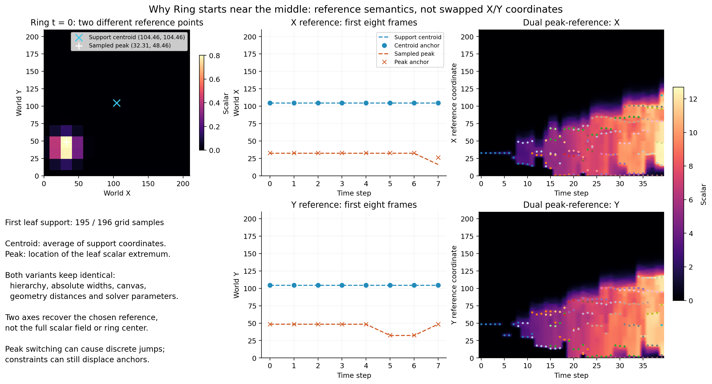
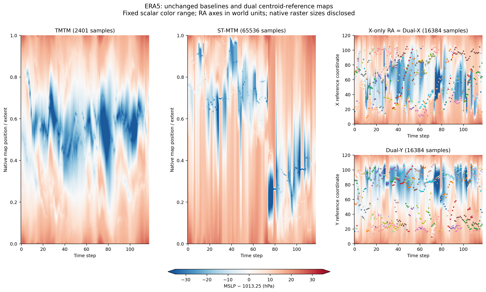

# Ring 为什么从中间开始，以及 ERA5 配色恢复

## 原因与术语更正

此前把支撑域质心笼统称为“真实位置”不够准确。X/Y 双轴只能表达选定参考点的两个分量，并不会自动把支撑域质心变成峰的位置。

Ring 第 0 帧只有一个叶 feature，其支撑域包含 196 个格点中的 195 个。
支撑域的非加权坐标平均位于 (104.46154, 104.46154)，因此原双轴质心版
anchor 为 (104.46154, 104.46154)。但采样标量峰位于 (32.30769, 48.46154)，
在左下方。连续生成器中心 (30.4, 40.6) 又是第三个概念；环扩张后，叶极值位于环上，
不等于环中心。前几帧的中心位置不是 X/Y 对调或逐帧归一化错误，而是所选参考点不符合看峰位置的目的。

## 新增对照及定义

保留原默认质心参考与所有历史结果。序列接口新增显式 `reference_points`：

- 质心参考：`q_i^(k) = a_k^T C_i`；
- 峰参考：`q_i^(k) = a_k^T E_i`，`E_i` 为同一叶 feature 的采样极值位置；
- 两者的 geometry 项均使用 `||C_i-C_j||₂`，面积、hierarchy、identity、参数完全相同；
- 两者分别重构所选参考点，不能将峰位置误差与质心位置误差混为一谈。

新 Ring 对照只改变参考点，保留 rho=0.5、fixed width、fixed world canvas、motion residual 和其余参数，
不采用之前历史 extrema 修订的 rho=1 / IoU temporal weighting。因此也不把两组不同协议混称为同一方法。
第 0 帧峰参考 anchor 为 **(32.79365, 48.55350)**，已回到左下方。
剩余偏差来自含 interval eccentricity 的目标权衡；本方法并不强制 anchor 精确等于 q。
第 7 帧峰 X=16.15385，而宽约104.46、rho=.5使 anchor 至少位于26.11607，
所以会存在不可避免偏差，不能通过偷缩宽度消除。



## 全序列结果：评价目标必须明确

40 帧，使用原始对应关系与固定域对角线 `D=210√2`。
`position_2d_nrmse = sqrt(mean(||P_hat-P_target||₂²))/D`。
所有单视图按各自评价目标使用相同的“真实 birth-Y 固定”oracle 解码；它们没有原生二维输出。
完整 motion/direction、geometry、tau 指标保存在 CSV，以下为位置指标：

| 方法 | 对支撑域质心的 2D NRMSE | 对采样峰的 2D NRMSE |
|---|---:|---:|
| TMTM | 0.22760 | 0.23646 |
| ST-MTM | 0.33300 | 0.33692 |
| X-only centroid RA | 0.06574 | 0.08611 |
| Dual centroid RA | **0.02908** | 0.08089 |
| X-only peak RA | 0.08599 | 0.06397 |
| Dual peak RA | 0.07949 | **0.02880** |

该结果说明参考点定义决定所保持的位置，而不是峰参考在所有任务上更好。
原 ST-MTM 的 centroid-distance NRMSE=0.28243，仍优于 Dual peak 的 X=0.50607、Y=0.38544。
Dual peak 的最大 tau_x=32.87912、tau_y=24.86916，仍有显著层次/参考冲突。
采样极值切换、支撑域改变及 feature correspondence 都可能造成跳变；这不是物质轨迹或连续环中心跟踪。

## ERA5 颜色卡

恢复 `experiments/real_era5/paper_figure.py` 的 `pressure_soft`：
使用 RdBu_r 的 [0.08,0.92] 区间，加相同的中央白色混合。
所有时刻/方法使用固定 `MSLP − 1013.25 hPa`，色标范围 [-35,35] hPa，
蓝色低压、红色高压。这是固定气压基准差，不是气候距平。
超出范围使用端点颜色，色条两端箭头以及 `era5/color_style.json` 披露饱和比例。
只重画已有数值结果，ERA5 指标、布局和 baseline 均不变。



## 验证与复现

8 个单元测试通过，包括显式参考点 finite/shape、跨帧 identity 重排、默认路径等价、
geometry 仍来自质心、固定像素映射、tau 独立 LP 与零运动指标。
新增 80 个完整标量渲染的拓扑检查全部通过；同一流程检查 hierarchy、宽度、interval gap 和 budget。
运行中出现当前平台 NumPy matmul floating-point warnings；未隐藏这些警告。
输出为 finite，约束和拓扑检查通过；本次未更改数值求解器来规避警告。
该对照不报告新 runtime 排名，也不覆盖原正式三次重复计时。

```sh
.venv/bin/python -m unittest discover -s tests -v
.venv/bin/python experiments/dual_reference/ring_reference_diagnostic.py
.venv/bin/python experiments/dual_reference/public_data.py --dataset era5 --plot-only
.venv/bin/python experiments/dual_reference/public_report.py
.venv/bin/python experiments/dual_reference/public_report.py --verify
```

关键文件：

- `src/ramtm/error_budget.py`：可选 landmark reference，默认仍为 centroid。
- `experiments/dual_reference/ring_reference_diagnostic.py`：新增诊断及对照。
- `results/dual_public/ring_reference_diagnostic/reference_points.csv`：逐帧逐 feature 参考点及 anchors。
- `results/dual_public/ring_reference_diagnostic/metrics_by_target.csv`：所有方法的两套目标评价。
- `results/dual_public/ring_reference_diagnostic/peak_{x,y}_records.json`：布局、tau、渲染校验。
- `results/dual_public/ring_reference_diagnostic/reference_diagnostic.{png,pdf,svg}`：诊断图。
- `results/dual_public/era5/{input_fields,comparison_maps}.{png,pdf,svg}`：恢复颜色卡后的图。
- `results/dual_public/era5/color_style.json`：颜色及饱和比例。
