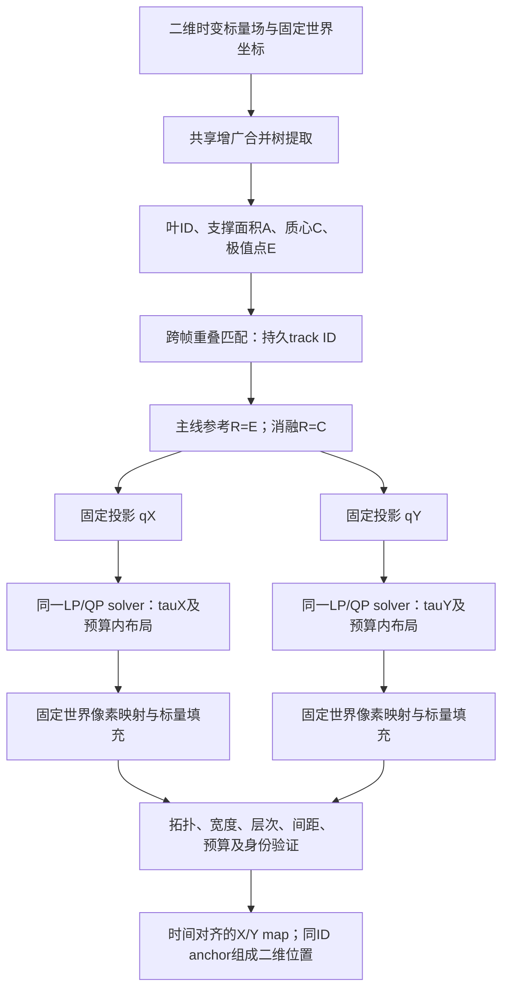

# XY RA-MTM：唯一主线方法流程

本项目当前研究的是**固定世界参考下、保持绝对宽度的层次约束双视图布局**。
主线采用叶极值参考：Ring split tree 是局部最大值位置；ERA5 join tree 是局部最小值位置。
支撑域质心参考是消融，不再与主线并列命名。旧 API 默认质心仅为兼容历史实验。

## 1. 三种坐标对象不能混用

| 对象 | 符号 | 定义/用途 |
|---|---|---|
| 固定世界坐标系 | 原点 O、单位、域 Ω | 全序列预先确定；不能按每帧 feature 范围重新缩放 |
| 支撑域质心 | C_i | 叶弧支撑格点平均位置，只用于主线的相对二维距离 |
| 叶极值参考点 | R_i=E_i | 原标量场中该叶的极值采样位置；主线希望保持的位置 |
| 轴向参考目标 | q_i^k | R_i 在固定单位方向 a_k 上的投影 |
| 优化 anchor | u_i^k | 实际一维显示坐标，允许在预算内偏离 q |
| 区间中心 | z_i^k | 承载 feature 的显示区间中心，不要求等于 anchor |

左下原点解决坐标系定义；极值/质心选择解决一个 feature 由哪个点代表。这两个选择独立。
Ring 使用 [0,210]²；ERA5 保留既有等积投影及固定围圆直径到120的各向同性比例，
地理矩形在 [0,120]² 中有固定 padding。这里的(0,0)是画布左下角，不是每帧最低谷，也不是经纬度(0°,0°)。
不为让图靠左下而平移每帧。

## 2. 处理顺序



共享树提取、支持区域定义与 correspondence 不属于本次创新。
X/Y 不能独立重排身份：layout 中的行必须对应同一帧同一 track ID；leaf ID 是帧内树顶点，不能冒充 track ID。

## 3. 投影、约束和目标

令方向有限且非零，将其归一化：`a_k = direction / ||direction||`。
在已固定的世界坐标下 `q_i^k = a_kᵀ R_i`；默认 aX=(1,0)、aY=(0,1)。
极值坐标和支撑质心始终使用同一个坐标变换与单位。

两轴独立布局，共享绝对测度与比例 `w_i=c A_i`。对所有合法树叶序 π，要求：

- 子树叶连续，父子关系不变；
- 相邻区间不重叠，至少间隔 g；
- 全部区间在固定画布内；
- `|u_i-z_i|≤rho*w_i/2`，anchor在合理区间范围内；
- `c`、画布和尺度全序列固定；容量不足报告不可行，不能缩小宽度。

先对各合法叶序求 LP：

`tau_k* = min_{π,u,z} max_i |u_i-q_i^k|`。

再以 `|u_i-q_i^k|≤tau_k*+Delta` 约束，最小化四个非负加权损失之和：

```
J = beta * mean_i (u_i-q_i)^2
  + gamma * mean_{i<j} (|u_i-u_j|-||C_i-C_j||₂)^2
  + lambda * mean_matched ((u_i^t-u_i^(t-1))-(q_i^t-q_i^(t-1)))^2
  + eta * mean_i (u_i-z_i)^2
```

主线所有匹配的 motion 权重相同；IoU 分层作为评价，不在本轮顺便引入新的调参。
新生/消失 feature 不强行连线。几何距离仍用二维质心距离，**没有换成投影距离或极值距离**。
这是一项明确的设计权衡，不能据此声称所有几何都被保存。

固定叶序为凸 QP，跨所有合法序比较目标。独立一阶误差界检查求解精度；超阈值时精化同一 QP，
不改变参考预算。tau衡量当前拓扑、宽度、间距和画布共同导致的冲突，不仅是拓扑冲突。

## 4. 输出与图例规范

两张图都横轴时间、纵轴固定世界参考坐标；上X、下Y，不旋转Y图。
世界位置到像素始终使用 `pixel=round((N-1)*(u-origin)/extent)`。
必要时整段提高 raster resolution，不能逐帧改变坐标映射。完整标量填充后检查拓扑签名。

主图背景只表示标量值，默认不覆盖身份散点。ERA5 使用原柔化红蓝 pressure_soft，固定
MSLP−1013.25 hPa、范围±35 hPa，显示端点饱和。红蓝不是 track 颜色。
独立轨迹图每列显式标注 track ID，同一列X/Y使用同一颜色；虚线为真实参考点，实线为优化anchor。
示例按存活长度选前三条，不根据误差挑选。

二维读出为 `R_hat_i=(u_i^X,u_i^Y)`，只按严格一致的 track ID 配对。
这恢复的是所选参考点的**估计位置**；不是原二维场，也不是完整feature形状。

## 5. 评价与对照

主线以极值为目标，消融同时报告以质心为目标的误差：
`position_2d_nrmse=sqrt(mean(||R_hat-R||₂²))/D`，D为固定域对角线。
同时报告两轴 reference NMAE/P95、tau、2D motion vector/magnitude error、trajectory error、方向误差，
以及原始二维 centroid-distance 的 stress/SNS/TW、绝对宽度误差、运行时间和raster误差。
方向误差对真实位移≤0.001倍轴范围不计；近零预测记pi，避免NaN或只排除不利预测。

正式比较包括 TMTM、ST-MTM、X-only extremum RA、Dual extremum RA，
以及 X-only/Dual centroid RA 消融。基线算法、预处理及参数不变。
单视图的二维 oracle/affine 读出只是统一评价规则，不能当作原算法原生二维输出。

## 6. 仍然不能解决的问题

极值可能因网格采样和平台值切换而跳跃；匹配只是支撑重叠，不是物理对象真值。
Ring环上极值不是连续环中心；ERA5叶极小值不是经过验证的气旋中心。
absolute reference、hierarchy、width、relative geometry可能不兼容；必须保留不利结果。
当前枚举适合小树，未解决大树可扩展性；没有证明所有数据集上的泛化或性能优势。

## 7. 对应实现

- `src/ramtm/reference_points.py`：显式参考点定义与严格X/Y身份配对。
- `src/ramtm/error_budget.py`：共用投影、LP/QP及可选reference_points。
- `src/ramtm/reference_anchored.py`：固定像素映射与共享scalar filling。
- `src/ramtm/dual_evaluation.py`：固定域归一化评价。
- `experiments/xy/run.py`：主线协议入口，调用共享实验驱动，不复制solver。
- `experiments/xy/verify.py`：审计、统一报告、当前manifest。
- `scripts/run_all.py`：主入口；默认public，显式mechanisms运行历史定义的机制控制。
