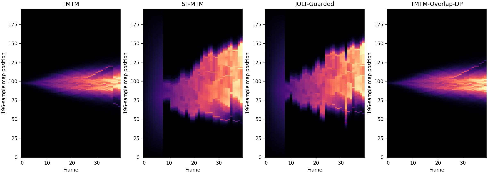

# JOLT-MTM：Ring 小树上限实验

日期：2026-09-23。暂定名 **Joint Ordering and Layout over Time Merge Tree Maps**，
中文为“时序联合排序与布局合并树图”。这是研究候选名称，不是已验证的新方法。

## 结论

**本轮没有得到同时超过 TMTM 和 ST-MTM 的方法，未通过预先设定的继续门槛。**
但是得到一个有效的算法发现：在保持论文1全样本分配的条件下，穷举每帧叶序并
用动态规划联合选择整段序列，使论文1原始子树重叠目标从480降至211（下降56.04%）。
这一分支同时改善论文1的 SNS、TW 和 TD，但空间关系仍不及 ST-MTM。

不要将失败解释为所有联合优化都不可能，也不要将单数据集结果当作投稿充分证据。
本次真正排除的是：在这个 Ring 输入上，**只更换论文1合法叶序而保留其样本分配，
无法在 SNS 上超过当前 ST-MTM 复现结果**。

## 协议和覆盖

- 输入：现有作者 Ring 生成器，40帧、14×14网格、1–7个叶特征；不改场、不简化树。
- 三方共享树提取、叶支持质心、面积和重叠匹配。不是重新运行作者 TTK/Inviwo 系统。
- 所有合法二叉叶序：746个“帧—叶序”组合，单帧最多64个，包含两个方向。
- A分支：论文1固定全样本分配，逐个枚举内部节点的左右子树交换。
- B分支：每个合法叶序下优化连续位置，使用论文2 Ring 最小间隔0.001和均匀距离权重。
- 因果对照：保持 ST-MTM 实际上一帧坐标及 λ=1.5，枚举当前叶序；这不是递归新方法。
- JOLT候选库：B分支＋因果对照＋每帧原始 ST-MTM 解。每帧 SNS、TW(k=1,3)、
  固定单位距离平方误差均不得劣于 ST-MTM，然后以动态规划最小化距离变化误差。
- 最终图全部使用196采样位置，无增大分辨率回退。原始基线和正式结果未覆盖。
- TW(k=1)覆盖27帧；TW(k=3)仅覆盖23、34、39三帧。SNS沿用40帧平均及单叶记零，
  同时另报32个非单叶帧的平均；不能用3帧TW结果代表完整时间序列。
- 动态指标涉及271个“相邻帧—共同匹配特征对”。TD涉及146个匹配位移。

预先记录的探索性继续条件：SNS至少降低5%，两种TW不下降、距离变化误差不增大，
并通过196采样拓扑检查；若仅距离变化RMSE改善至少10%，可保留为时间方向线索。
这些阈值是研究投入门槛，不是统计显著性标准。协议原文见
[实验说明](../../experiments/history/jolt_mtm/README.md)。

## 连续骨架结果

| 方法/诊断 | SNS↓ | TW(k=1)↑ | TW(k=3)↑ | 距离变化NRMSE↓ | TD↓ |
|---|---:|---:|---:|---:|---:|
| TMTM | 0.136475 | 0.703968 | 0.793651 | 0.033337 | 282.154 |
| ST-MTM | 0.064366 | 0.922663 | 0.936508 | 0.052797 | 780.712 |
| 论文1逐帧SNS最优叶序 | 0.086047 | 0.878263 | 0.896825 | 0.032070 | 927.231 |
| 自由位置逐帧SNS最优 | 0.060086 | 0.915388 | 0.944444 | 0.067673 | 6254.796 |
| 相同ST历史下逐帧SNS最优 | 0.064206 | 0.910317 | 0.936508 | 0.064868 | 1064.168 |
| JOLT-Guarded | 0.063724 | 0.924206 | 0.936508 | 0.049294 | 1957.369 |
| 同候选库逐帧选择最低SNS | 0.060321 | 0.931746 | 0.944444 | 0.058461 | 6850.449 |
| 论文1全序列重叠DP | 0.111943 | 0.779806 | 0.817460 | 0.030658 | 143.231 |
| 后续诊断：JOLT再约束逐步TD | 0.064366 | 0.922663 | 0.936508 | 0.052797 | 780.712 |

“逐帧SNS最优”是诊断，不表示该路径在TW或时间指标上最优。
因果对照保留同一ST历史，说明在原时间正则条件下，仅枚举顺序带来的SNS收益仅0.247%。
放开时间正则的SNS最优解则有6.648%的空间，但TW(k=1)和动态误差退步。

JOLT-Guarded改变了7帧，SNS降低0.996%，距离变化NRMSE降低6.635%，
未达到原门槛；TD却显著上升。这个距离变化目标对平移和反射不敏感，因此不保证
画面位置连续。后续增加“每一相邻帧TD不高于ST”的限制后，当前候选库的DP路径
回到了ST基线。该后续诊断没有替代原始失败结果，也不是连续可行域不可改进的证明。

论文1重叠DP相对原TMTM：SNS下降17.98%，TD下降49.24%，距离变化NRMSE下降8.04%；
TW(k=1)从0.70397升至0.77981，TW(k=3)从0.79365升至0.81746。
这些伴随收益是本数据上的观察，并不是最小化重叠目标自动保证的性质。

## 上限结论为何成立，以及哪里不成立

固定叶序后，相邻坐标差记为 g，成对距离为 A g，原始距离向量为 d。
均匀应力问题是 min ||A g-d||²，约束 g≥δ。令 h=g−δ，用NNLS求解并核查KKT条件。

另求 g≥0 的松弛。其可达距离集合是锥，SNS中的正比例系数可以吸收到g，故
min ||A g-d||² / ||d||² 给出该叶序下SNS的下确界。遍历所有合法叶序后得到
全序列平均下确界0.0600863383；它放松了严格间隔，也不包含区间、画布、时间和
邻域约束，因此是用于判断最大改善空间的界，不是一张自动合法的最终地图。
本次δ=0.001的逐帧最优候选在数值精度内达到了同样的SNS。

这个界意味着：在当前特征定义、树层次和一维欧氏位置表达下，ST-MTM 的SNS最多
还有约6.65%的相对改善空间；叠加其他目标一般只能缩小空间。它不约束其他数据集。

论文1A分支穷举全部固定分配布局，最好的平均SNS仍为0.086047，比ST高33.68%。
这一结论比“某个启发式没找到好结果”更强，但只针对该固定样本分配类。

重叠DP在A分支中枚举了全部状态，且论文1目标可分解为相邻帧代价，因此211是
这个固定样本分配类中的整段最优值。JOLT的DP只在预先拟合的有限候选库中最优；
它没有联合重新优化所有连续坐标，也没有穷尽TW约束下的连续布局。

## 指标定义与显示预算

距离变化误差是匹配特征对的一维距离变化减去原域质心距离变化，平方平均后开方，
再除以固定域跨度210。不做逐帧尺度拟合。SNS自身按定义拟合尺度，两者不可混用。
该指标评价关系变化，不感知共同刚性平移，不等同于完整物理运动真值。

| 196采样输出 | SNS↓ | TW(k=1)↑ | TW(k=3)↑ | 距离变化NRMSE↓ |
|---|---:|---:|---:|---:|
| ST-MTM | 0.064246 | 0.921120 | 0.936508 | 0.052069 |
| JOLT-Guarded | 0.063905 | 0.913845 | 0.936508 | 0.050000 |
| 论文1全序列重叠DP | 0.111943 | 0.779806 | 0.817460 | 0.030658 |

JOLT连续坐标上的邻域不退步条件没有传递到像素结果，TW(k=1)下降。
全部9条序列的360帧输出均通过叶极值/分支合并值拓扑签名检查；这不是一般拓扑定理。
ST-MTM有40帧含单像素叶区间，JOLT-Guarded有32帧；拓扑通过不等于宽度可读性通过。
B分支沿用ST的K=1宽度分配与填充，不宣称绝对面积保真。
A分支则保留196个原样本及其标量值的一一映射。



## 验证与复现

```sh
.venv/bin/python experiments/history/jolt_mtm/run_pilot.py
.venv/bin/python experiments/history/jolt_mtm/verify_pilot.py
```

3379项数值/结构检查通过：独立重算9条路径指标；15个位置解以现有SLSQP交叉核验；
12个小状态图穷举验证DP；全部候选核查SNS下界；全部输出核查固定分辨率和拓扑。
NNLS与SLSQP目标的最大相对差为1.02×10⁻¹⁴。一次完整探索约4.4秒，包含不同工作项，
不能与基线单次布局时间直接比较，更不能据此声称大树可扩展性。

结果文件：

- [连续指标](../../results/exploratory/jolt_mtm/continuous_metrics.csv)
- [像素指标](../../results/exploratory/jolt_mtm/raster_metrics.csv)
- [每帧上限](../../results/exploratory/jolt_mtm/frame_oracles.csv)
- [全部候选](../../results/exploratory/jolt_mtm/candidates.csv)
- [选中路径](../../results/exploratory/jolt_mtm/selected_paths.json)
- [求解证书](../../results/exploratory/jolt_mtm/solver_certificates.csv)
- [验证记录](../../results/exploratory/jolt_mtm/verification.json)

## 决策

不将当前JOLT候选升级为“同时超过两篇论文”的新方法，也不在Ring上继续仅靠排序
启发式堆复杂度。保留“论文1全序列重叠优化”作为已发现的有效算法改进点；如果后续
研究继续，应在独立数据上检验该收益，并明确是否允许改变样本/区间分配以增加几何
自由度。当前证据不支持承诺在相对几何、绝对数量和时间稳定性上同时严格胜出。
