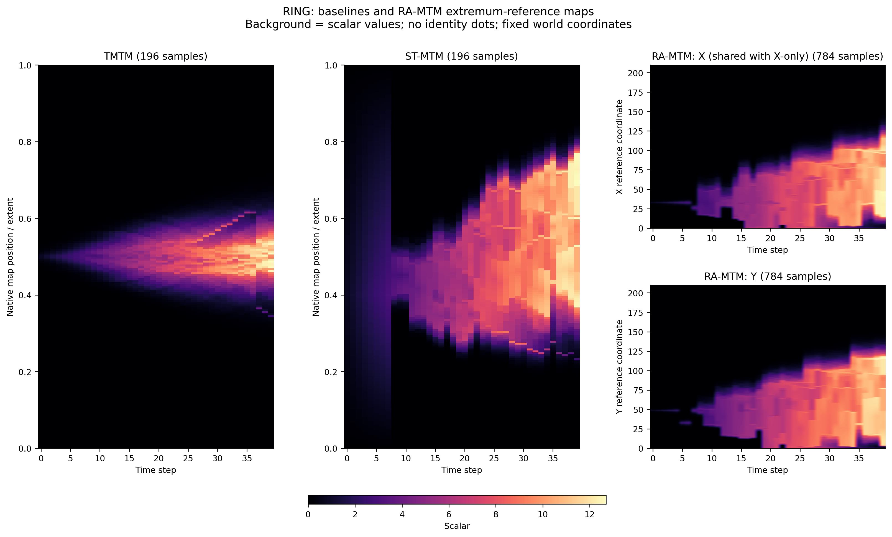
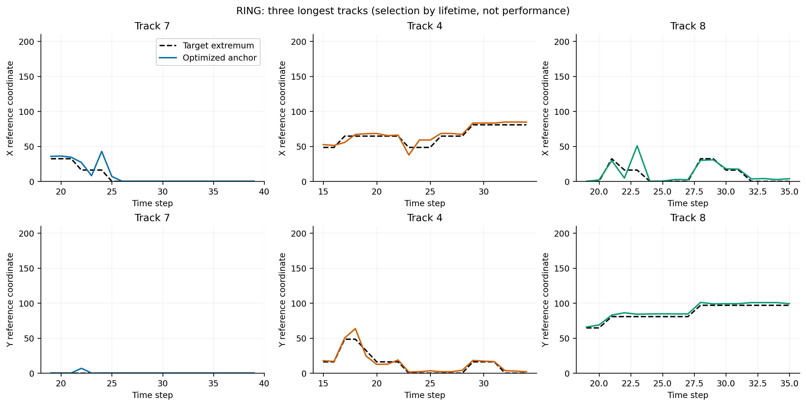
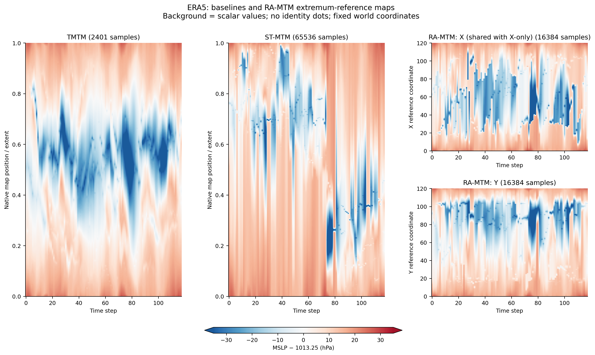
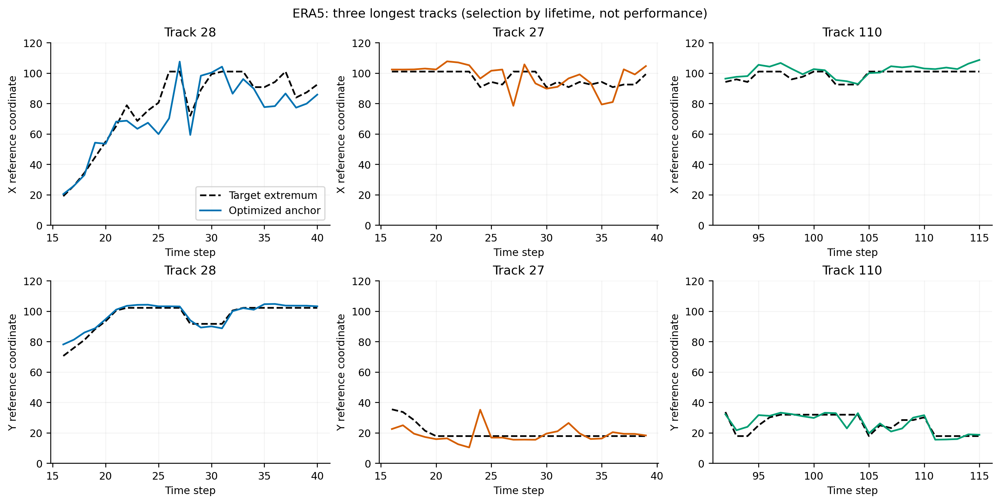

# RA-MTM 当前实验报告

当前主线：固定世界坐标中的叶极值参考（Ring 为最大值点，ERA5 join tree 为最小值点）；质心只定义 geometry，并作为参考点消融。
完整定义见 [方法流程](method.md)；单轴推导见 [求解细节](solver.md)。

## 协议

共享输入、树、支撑域与 correspondence；baseline 源码与历史一致。保留原参数 rho=.5、beta=4、gamma=1、lambda=.5、eta=.1，固定面积到宽度比例，不针对结果调参。
每方法三次循环顺序重跑，表中运行时间为 layout/render/validation 中位数；Dual 时间含 X+Y。
位置与运动以叶极值为真值，按固定方形域对角线归一化；全部方法也保留质心目标评价。单视图二维读出给予真实 birth-Y 固定的 oracle，不能称为原生二维恢复。另保存首帧二维 affine calibration 敏感性。
方向角只在真实运动大于 0.001 倍固定轴范围时统计；近零预测方向按 pi 计入。边界 feature 及 IoU 分层见 tracking_robustness.csv。

## 所有结果

### RING

| 方法 | 2D位置 NRMSE | 轨迹 NMAE | 方向误差(rad) | 距离误差X / Y | 时间(s) |
|---|---:|---:|---:|---:|---:|
| TMTM | 0.23646 | 0.07388 | 2.10727 | 0.85792 / — | 0.03242 |
| ST-MTM | 0.33692 | 0.11695 | 1.88122 | 0.28243 / — | 0.12259 |
| X-only RA-MTM | 0.06397 | 0.05429 | 0.99463 | 0.50607 / — | 0.43484 |
| RA-MTM | 0.02880 | 0.03039 | 0.16143 | 0.50607 / 0.38544 | 0.80819 |
| X-only centroid RA | 0.08611 | 0.06489 | 1.50035 | 0.51434 / — | 0.42788 |
| Dual centroid RA | 0.08089 | 0.04771 | 1.03171 | 0.51434 / 0.38400 | 0.77113 |

### ERA5

| 方法 | 2D位置 NRMSE | 轨迹 NMAE | 方向误差(rad) | 距离误差X / Y | 时间(s) |
|---|---:|---:|---:|---:|---:|
| TMTM | 0.24682 | 0.16838 | 1.57660 | 0.52586 / — | 0.70615 |
| ST-MTM | 0.60856 | 0.15921 | 1.52581 | 0.29998 / — | 0.75245 |
| X-only RA-MTM | 0.08364 | 0.07663 | 0.91265 | 0.51556 / — | 1.63159 |
| RA-MTM | 0.05830 | 0.05459 | 0.64123 | 0.51556 / 0.38673 | 3.19011 |
| X-only centroid RA | 0.08974 | 0.08406 | 1.13757 | 0.52682 / — | 1.57260 |
| Dual centroid RA | 0.07234 | 0.07288 | 0.96316 | 0.52682 / 0.39402 | 3.09275 |

## 解释与限制

主要回答增加 Y 参考是否能表达第二个位置/运动分量，以及参考点语义是否符合任务。不得用改变真值后降低的误差声称全面优越。ST-MTM 的相对几何仍可能更好；tau、参考预算和 geometry error 必须一起阅读。
Ring 前期支撑质心覆盖近全域，改用叶峰参考解决从域中心起步的语义问题。峰/谷不是环中心，也不是经过气象验证的气旋中心。网格极值跳跃、支撑变化和匹配歧义仍会污染运动。
当前保留小树合法叶序枚举，不承诺大规模性能；只逐帧因果求解，不是全时空联合最优。两个视图不恢复完整二维标量场。
ERA5 极值 X 参考第110帧触发原独立QP误差界0.01检查。求解器增加按证书触发的同目标二次精化，没有放宽约束或检查阈值。当前平台 NumPy matmul 警告保存在 results/execution.log（本地）；输出 finite、约束与证书均单独检查。

## 图例与文件

comparison_maps：背景是标量值，不叠加身份点。longest_tracks：每列明确 track ID，虚线是目标参考点，实线是优化 anchor；三条轨迹按存活长度选择，不按表现筛选。ERA5 使用原 pressure_soft 红蓝卡，固定1013.25±35 hPa，非气候距平。
`results/{ring,era5}/metrics.csv` 为当前主表；`metrics_by_target.csv` 为两套真值；`*_records.json` 为完整证书；`protocol.json` 为参数与数据来源；`validation.json` 和根 `manifest.json` 为审计。

复现：`.venv/bin/python scripts/run_experiments.py`；仅验证已发布文件：`.venv/bin/python scripts/verify_results.py --verify`。
