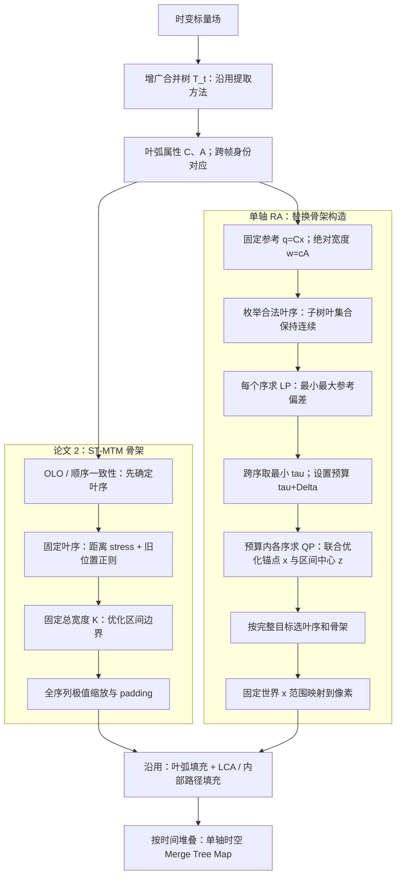
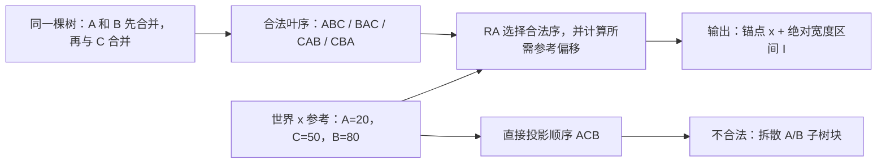

# 原始 RA-MTM（仅世界 x 轴）：具体改进与流程

本文仅讨论单轴 RA，不包含 dual-reference、Y 轴或二维位置重建。依据本地 paper1 的 §3.1、Algorithm 1、§3.2，以及 paper2 的 Fig. 3、§4.1–4.2，与当前代码中的默认 X-only 路径核对。“原始”指单轴方法；不等同于恢复某个历史提交的旧目标函数。

## 1. 方法定位

RA 不修改输入合并树的父子关系、叶子身份、极值或合并值；它修改的是这棵树在一维轴上的合法布局。相较 ST-MTM 的“先确定叶序，再投影锚点，再分配区间”，RA 将叶序选择与锚点/区间位置纳入同一个参考误差预算框架：先求保持层次和绝对宽度所需的最小参考偏移，再在预算内选择布局。

因此，不能写成“提出新的合并树结构”，也不宜仅写成“在 ST-MTM 公式中增加参考项”。更准确的定位是：**固定世界参考下、保持绝对测度的层次约束一维布局方法**。

## 2. 对照两篇论文的流程

| 环节 | 论文 1：TMTM | 论文 2：ST-MTM | 单轴 RA |
|---|---|---|---|
| 输入与树 | 标量场、增广合并树 | 沿用增广合并树，提取叶弧质心和大小 | 沿用树，增加固定参考 q=Cx；保留质心 C、测度 A |
| 叶序 | 内部结点选择左右子树遍历顺序；以跨帧子树重叠差异作贪心优化 | OLO 减小相邻质心距离；时间模式用顺序一致性和阈值决定是否换序 | 枚举层次合法叶序；对每个序求可行参考误差，再按预算内完整布局目标选序 |
| 叶子坐标 | 从遍历与样本数分配中产生 | 固定序后最小化距离 stress，并可锚定上一帧显示位置 | 世界 x 参考误差上界 + 参考损失 + 距离 stress + 可选运动残差 |
| 特征宽度 | 全样本线性化中的样本数量语义 | 固定总量 K 下，拟合相对大小目标 | 硬约束 w=cA，c 跨帧固定，允许总叶宽随总测度变化 |
| 求解依赖 | 遍历、样本分配与顺序优化 | 顺序 → 锚点 → 区间 | 合法序候选 → LP 最小误差 → 预算内联合优化锚点及区间中心 |
| 输出坐标 | 样本索引 | 全序列区间极值共享缩放，加对称 padding | 预先固定世界范围的统一像素变换 |
| 标量填充 | 对全部原始样本建立线性化映射，显示阶段可下采样 | 叶弧采样，LCA/内部路径及边界填充 | 沿用论文 2 填充策略，不计作新贡献 |

论文 2 已有全序列共享尺度，不能把它描述为逐帧独立归一化。论文 1 已有样本数量的绝对量语义，不能声称 RA 首次引入绝对大小。

## 3. 在合并树上，叶子究竟怎么变化

### 3.1 变化的是嵌入顺序，不是树拓扑

以 T=((A,B),C) 为例，A、B 必须构成连续子树块。可以有 A-B-C、B-A-C、C-A-B、C-B-A；不能有 A-C-B 或 B-C-A。

换序相当于在内部结点翻转左右子树。A 的父结点仍是原父结点，A/B 的合并值不变，C 也不会被接到 A/B 子树内部。叶子数的变化来自输入场与树提取，而非 RA 为满足投影主动增删叶子。

假设固定参考为 qA=20、qB=80、qC=50。直接按世界 x 排序会得到 A-C-B，破坏 A/B 的连续性。RA 必须在上述四个合法序中选择，并允许显示锚点偏离 q。偏离多少由 LP 计算；不能把这个例子的具体偏移量脱离宽度、间距、画布和 rho 单独指定。

### 3.2 与论文 2 的真正差别

论文 2 在投影之前用距离和顺序一致性确定叶序。RA 的 `leaf_orders` 给出所有合法候选，`solve_frame` 为每个候选建立区间约束并求 LP，再计算预算内的 QP 目标。最终叶序由完整布局结果决定。

注意：第一阶段求出的是所有叶序中的最小参考偏差 tau*；若额外预算 Delta>0，最终叶序可以不是单独取得 tau* 的那个序，只要它在 tau*+Delta 内可行且 QP 目标更优。准确说法是“全局最小参考偏差确定预算，预算内选择叶序和连续布局”。

## 4. 叶子到 1D 区间的具体变化

每个叶特征以三个量表示：参考 q_i、显示锚点 x_i、区间 I_i。用 z_i 表示区间中心。

\[
q_i=C_{i,x},\qquad w_i=cA_i,\qquad
I_i=[z_i-w_i/2,z_i+w_i/2].
\]

q 是叶弧支持的质心 x 坐标，通常不等于该叶极值采样点的 x 坐标。x 是极值在输出一维域中的放置位置；z 是其承载区间的中心，二者可以不同。

### 改进 A：从相对距离布局到固定参考布局

论文 2 的几何项依赖 d_ij=||C_i-C_j||。所有特征共同平移时，距离矩阵不变，因此距离项本身无法辨认该共同运动。RA 引入固定世界参考 q=Cx，使显示位置有明确的方向、原点和单位。

这不意味着 x=q 永远成立；层次、拥挤、宽度和画布边界都可能要求偏移。

### 改进 B：从固定总宽度份额到绝对测度宽度

论文 2 的目标宽度为

\[
\widehat w_i=K\frac{A_i^\alpha}{\sum_j A_j^\alpha},\qquad \sum_iw_i=K.
\]

实际宽度通过约束优化拟合目标，未必等于目标。RA 直接固定 w_i=cA_i。若特征测度由 (10,20) 增长为 (20,40)，论文 2 的目标比例保持不变、总宽度仍为 K；RA 的两个区间宽度均加倍，前提是画布能容纳。

若只有 A 增长，B 的连续区间宽度不变；但为避免重叠，B 的位置仍可能被迫移动。绝对宽度不等于绝对位置都能无误差保持。

### 改进 C：先量化不可避免的偏差，再优化布局

对合法序 pi，约束相邻区间满足

\[
z_{\pi(k+1)}-z_{\pi(k)}\ge
\frac{w_{\pi(k+1)}+w_{\pi(k)}}2+g,
\qquad |x_i-z_i|\le\rho w_i/2,
\]

并要求区间在预设画布内。第一阶段为

\[
\tau^*=\min_{\pi\in\mathcal P(T),x,z}\max_i|x_i-q_i|.
\]

固定 pi 后用 LP 求解。tau* 是在当前宽度、间距、画布和锚点偏心限制下的最小最大参考偏差，不是仅由树拓扑决定的量，也不是二维重建误差。

第二阶段令 |x_i-q_i|<=tau*+Delta，并在可行叶序内最小化

\[
J=\beta E_{ref}+\gamma E_{geom}+\lambda E_{motion}+\eta E_{ecc},
\]

其中

\[
E_{ref}=\frac1n\sum_i(x_i-q_i)^2,\quad
E_{geom}=\frac1{\binom n2}\sum_{i<j}(|x_i-x_j|-\|C_i-C_j\|)^2,
\]
\[
E_{motion}=\frac1{|M|}\sum_{i\in M}[(x_i^t-x_i^{t-1})-(q_i^t-q_i^{t-1})]^2,
\quad E_{ecc}=\frac1n\sum_i(z_i-x_i)^2.
\]

这里给出匹配置信度为 1 的形式；首帧/无匹配省略运动项，单叶省略几何项。原始空间距离继续使用完整 C 的欧氏距离，并没有替换成 |q_i-q_j|。

固定叶序下，距离差的符号已知，因此第二阶段为凸 QP。跨叶序求解属于离散候选与连续布局的联合选择；当前逐帧求解不是整段时间序列的联合全局最优。

### 改进 D：时间正则从“少移动”改成“少引入错误移动”

论文 2 的位置正则为 (x_t-x_prev)^2；RA 使用 ((x_t-x_prev)-(q_t-q_prev))^2，即参考误差 e=x-q 的跨帧变化。

如果世界 x 参考移动 +10，RA 的时间目标是 x_prev+10。正确移动 +10 时残差为 0；仍停在原位则产生残差。拥挤等约束仍可能阻止完全实现该目标。

此项适合作为辅助机制，不应在没有消融支持时单列为主要性能贡献。新生特征没有上一帧目标；死亡特征退出当前帧，身份对应由外部匹配输入提供。

### 改进 E：固定世界坐标离散化

对预设世界范围 [a,a+L] 和 N 个像素，统一使用

\[
p(u)=\operatorname{round}\left((N-1)\frac{u-a}{L}\right),\quad
u\in\{x_i,z_i-w_i/2,z_i+w_i/2\}.
\]

宽度随测度变化的保证针对连续区间，最终像素宽度有舍入误差。连续容量不足时应改变设计参数或报告不可行，不能静默缩小宽度；只有像素分辨率不足才可通过提高 N 解决。

随后沿用论文 2 的 leaf filling 和 hierarchical gap filling：在锚点放叶极值，采样叶弧填充区间，按相邻叶 LCA 与内部树路径填空隙。RA 不重新定义合并值，也没有提出新的标量填充器。

## 5. 可用于方法章节的贡献表述

> 本文在增广合并树的一维可视化框架中引入固定世界 x 参考，将叶特征的显示锚点关联到其支持区域的质心投影，并以跨时刻一致的测度到宽度转换保持特征绝对大小。在保留原树层次关系的前提下，我们将叶序与连续区间布局纳入统一的参考误差预算框架：首先通过合法叶序上的线性规划求得最小可行参考偏差，随后在允许预算内联合优化锚点和区间中心，兼顾参考保真、相对几何与运动残差。最终使用固定世界坐标变换生成一维骨架，并沿用已有层次填充策略构造时空图。

主要贡献建议归为三点：固定参考与绝对测度编码；合法叶序与连续布局的预算约束求解；固定坐标输出与运动残差配套机制。不能仅凭本次两篇论文对照声称这些优化技术本身具有全领域首创性。

## 6. 流程图

图中 x 指原始空间的固定参考方向；最终图片的横轴或纵轴可以按排版旋转。当前渲染代码将时间放在列方向，因此不能把“世界 x 参考”与“图片横轴”混为一谈。

## 核对位置与边界

- paper1.pdf：§3.1、Algorithm 1；§3.2.1–3.2.2；§3.3。其 Merge Tree Identity 证明针对原方法，不能直接当作 RA 填充输出的一般性证明。
- paper2.pdf：Fig. 3；§4.1.1–4.1.3；式 (1)(2)；Fig. 4/5 与 §4.2。本地稿标记为未同行评审预印本。
- src/ramtm/error_budget.py：leaf_orders、constraints、solve_frame、solve_sequence。
- src/ramtm/reference_anchored.py：render_sequence。
- src/ramtm/baselines/stmtm.py：fill_leaf_intervals、fill_internal_gap、fill_frame。

当前枚举求解适用于小树。参考位置与二维距离可能冲突，不能声称单轴 RA 同时无损保持全部几何、绝对位置和运动。本文为方法核对与解释，未重新运行完整实验。
