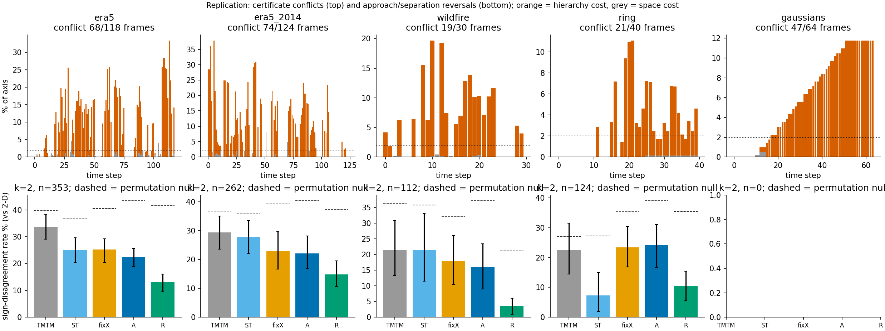
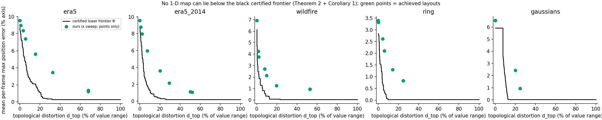
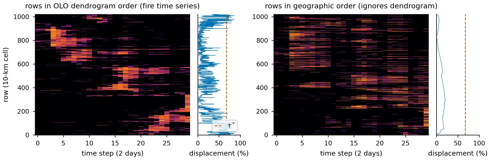

# 层次约束的一维布局能有多忠实？——合并树时空图中位置与拓扑权衡的可证明刻画

**How Faithful Can a Hierarchy-Constrained 1-D Layout Be? Certified Position–Topology Trade-offs for Merge Tree Maps and Beyond**

> **中文正文 v0.3（2026-09-26，已按 ARIS / GPT 交叉评审修订，评审记录见 `notes/review/2026-09-26-research-review.md`）。** 目标：PacificVis 2027 Conference Paper Track（正文 9 页 + 2 页参考文献）。
> 完整证明见 [proofs_zh.md](proofs_zh.md)。所有数字来自 `prototypes/output/*.json`，可以用 `prototypes/replicate.py`、`frontier.py`、`generality.py` 复现。
> 标 **【待补】** 的是尚缺的内容；标 **【审稿】** 的是 ARIS 交叉评审中提出、待处理的意见。
> ERA5 数据来自 ARCO 镜像：与合作者 CDS 原始文件提取出的轨迹、层次与极值完全一致，但支撑面积与质心有微小差异（最大分别为 3.0 与 0.21 个布局单位）。**投稿前须用 CDS 原文件和最终协议重跑。**
> 合作者的参考锚定布局（LP + QP）**未发表**，本文把它作为方法的组成部分（§3.2），不作为前人工作引用。

---

## 摘要

**问题。** 把二维时变数据压缩为一维、再按时间排列的静态图，被广泛用于展示特征随时间的演化。这类图的一维顺序往往受某个层次结构约束：合并树图要求同一子树的叶子相邻，聚类热图与稠密像素图要求树状图（dendrogram）中同一簇的元素相邻。然而，层次约束与空间位置可能相互矛盾。已有方法会度量布局质量，例如 ST-MTM 的距离 stress 与邻域指标，但没有一种方法给出**相对位置参考的不可避免最大偏差**，也没有说明降低这一偏差需要牺牲多少层次信息。

**方法。** 本文把这类图形式化为层次约束的一维区间布局，证明了三个结果：
1. 对每个时刻，可以在显示分辨率下用**伪多项式**时间精确计算（到二分容差）一个下界 τ\*：任何满足层次约束的布局，其最大位置偏差都不低于 τ\*。τ\* 还可以分解为层次造成的部分与空间容量造成的部分。
2. **任何**一维图只要打破某个子树的连续性，其合并层级失真就至少是该合并与其父合并之差的一半，与填充方法无关；在双射叶标签、叶高不变、无额外极值的条件下，这一失真就是带标签交错距离。
3. 由以上两点得到一条**位置–拓扑下界曲线**：任何一维图都不可能同时低于它。

**结果。** 在两个领域的三个真实数据集上（两个欧洲气压冬季、一个澳大利亚山火季）：
- 取自动参考方向时，58–63% 的时刻存在超过可辨阈值的层次冲突；在测试的全部 8 个固定方向上，这一比例为 23–77%；最大偏差可达轴长的 20–40%；
- 用几何读者代理检查"两个特征是在靠近还是远离"，现有合并树图的纵向距离变化与真实距离变化**符号相反**的比例为 21–34%，TMTM 接近置换零假设；
- 按证书进行受控放松后，符号不一致降到 4–15%（在山火上以更多的漏判为代价），其拓扑代价可以被精确度量；
- 同一下界也适用于按树状图排序的稠密像素图：按时间序列相似度聚类的层次，会迫使 47–48% 的显示高度发生位置偏移。

**关键词**：层次约束布局；合并树；时变标量场；静态可视化；忠实度；交错距离

---

## 1 引言

在一张静态图中展示时空数据的全部演化，是可视化长期关注的问题。气象学中的 Hovmöller 图 [5] 沿固定经线或纬线展示天气系统的传播；MotionRugs [8] 等稠密像素图 [40] 把每个时刻的实体排成一列像素，用于观察集体运动；Franke 等人 [3] 比较了多种一维投影在时空现象分析中的效果；基于合并树的时空图 TMTM [1] 与 ST-MTM [2] 把标量场的每个时刻线性化为一列，同时保持特征的拓扑结构。这些方法的共同点是：**把二维空间压缩为一维，把时间放在另一个轴上**，读者再从纵向的远近去推断空间上的远近与运动。

它们还有另一个共同点：**一维顺序往往受一个层次结构约束。**
- 合并树图要求同一子树的叶子相邻，这是保证特征不被打散、合并树被保留的前提 [1]；
- 聚类热图 [41] 与稠密像素图的层次排序 [3] 要求同一簇的元素相邻；
- 地理系统发育图 [17] 要求系统发育树的叶序与地图位置对应。

层次关系与空间位置并不总是一致：两个低压可能因为同处一个低压槽而先合并，而第三个不属于该槽的低压，在地理上却恰好位于二者之间（图 2）。此时，任何满足层次约束的一维布局都必须把某个特征画在错误的位置上。

**可视化的误导性**已受到广泛关注：视觉"海市蜃楼"会让读者看到数据中并不存在的模式 [42]；降维图中的距离与簇大小常被误读 [43]；投影质量需要用可信度、连续性等指标来评估 [38, 44]。ST-MTM 报告了距离 stress 与邻域指标，并明确讨论了一维布局不可能同时保持所有距离 [2, §7]。然而，**这些指标描述的是某个布局的质量，而不是任何满足层次约束的布局都无法避免的偏差；也没有方法说明降低偏差需要牺牲多少层次信息。**

我们用一个几何读者代理检验这种失真的后果（§7.3）。在 1999 年欧洲风暴季的气压数据上，若按图中两条色带的纵向距离变化判断两个低压在 24 小时内是靠近还是远离，TMTM 有 33.7% 的判断与真实变化符号相反（置换零假设为 39.7%），ST-MTM 有 24.9%。这是几何层面的诊断，不是对真人读者的测量。

> *In up to one in three clear cases, the vertical distance change on a merge tree map has the opposite sign of the true approach or separation of two storms — and the map gives no warning.*

**研究问题。** 本文回答：**满足层次约束的一维布局，最多能在多大程度上忠实于空间参考坐标？其不忠实的部分能否被证明、定位和控制？**

我们的思路与 Meulemans 的主张 [25] 一致：可视化的质量必须先被定义，才能被度量和保证。因此，本文不是提出"又一个更好的布局"，而是给出**可证明的下界**与**可控的权衡**。

**贡献。** 本文收敛为三条贡献：

1. **位置偏差证书及其精确算法**（§4–5）。
   - 把合并树图与按树状图排序的像素图统一为层次约束的一维区间布局，区分拓扑、位置、大小三种忠实度。
   - 对每个时刻给出最小可达最大偏差 τ\*：固定叶序时有闭式解；可以分解为层次代价 H 与空间代价 τ_free；并给出可解释冲突的"见证三元组"。
   - 给出显示分辨率下的精确可行性算法（定理 1）。它关于分辨率是**伪多项式**的，二叉层次的证书因此可以扩展到数千个叶子。
2. **与填充无关的拓扑代价与位置–拓扑下界**（§6）。
   - **定理 2**：任何一维图，只要打破某个子树的连续性，其合并层级失真就至少是该合并与其父合并之差的一半，与布局算法和填充方法无关。在明确的标签约定下，这一失真等于带标签交错距离。
   - **推论 1**：由此得到一条**必要的**位置–拓扑下界曲线，并可用严格下界精确计算。
   - 在此基础上给出一种按合并强度阈值、由证书触发的放松方法，其最终拓扑代价可以被度量。
3. **跨领域刻画与一个具体的设计用途**（§7）。
   - 在三个真实数据集（两个领域）与两个合成数据集上，刻画冲突的普遍性、几何读者代理下的符号不一致，以及修正的代价；
   - 把证书用于 1024 个叶子的树状图排序像素图，判断哪些层次根本无法忠实于空间。

**主要发现。**
- 在真实数据上，层次冲突普遍存在：自动方向下为 58–63% 的时刻，不同参考方向下为 23–77%；而且失真几乎全部来自层次，而非空间容量（后者不到轴长的 5%）；
- 修正冲突的代价取决于数据的合并结构：山火数据冲突来自弱合并，放松几乎不耗费拓扑；气压场冲突来自强合并，代价昂贵。

---

## 2 相关工作

**时空数据的静态摘要。**
- Hovmöller 图 [5] 与径向–时间图，是气象学中沿固定参考坐标展示演化的标准工具，但会对另一维做聚合或切片。
- 空间填充曲线 [3, 4] 与像素导向技术 [40] 追求紧凑的一维排列；Keim 把像素排列的设计表述为明确的优化问题 [40]。
- MotionRugs [8]、Stable Visual Summaries [9]、SpatialRugs、MoReVis [11] 与 GroupRugs [10] 面向轨迹与区域数据，其中 **GroupRugs 要求群组在一维中连续**，与本文的层次约束最为接近，但它评估的是排序的邻域质量，没有给出冲突的下界。
- 基于拓扑的静态图方面：拓扑景观 [6] 与保几何的拓扑景观 [7] 构造与原场拓扑等价的地形；TMTM [1] 与 ST-MTM [2] 在一维中保持合并树。

**层次约束的排序。**
- 最优叶序 [16] 在树允许的叶序上最小化相邻元素的差异，是聚类热图 [41] 的标准做法。
- 地理系统发育图 [17]、按外部顺序重排树 [18]、位移最优的 tanglegram [19] 研究树约束下的叶序，但目标是交叉数、逆序数或位移之和。
- 时变树图 [31, 37] 与嵌套追踪图 [32] 在时间上优化层次布局。

**忠实度、失真与权衡。**
- 可视化"海市蜃楼" [42]、降维图的误读 [43]、可信度与连续性 [38, 44] 揭示了抽象视图的误导风险；Aupetit [23] 把投影失真直接画在图上；Rauscher 等人 [12, 13] 为一维排序标注邻域失真。
- 面积变形地图需要权衡面积、形状与拓扑误差 [22]；数据–空间网格图 [21] 在空间布局与数据布局之间渐变；空间有序树图 [20] 度量层次布局中的位置一致性。
- Kindlmann 与 Scheidegger [24] 从数据与视觉的对应关系出发提出设计原则；Meulemans [25] 主张把质量定义与算法分离。

本文在层次约束的一维布局中，第一次给出**位置失真的精确下界**与**位置–拓扑的可证明权衡**。

**一维放置算法。**
- 无层次约束时，区间在直线上的最小最大位移分离可以在 O(n log n) 时间内求解 [14]，对应本文的 τ_free。
- IPSep-CoLa [15] 用分离约束的二次规划做布局。
- 本文的动态规划与调度问题中的"最早完成"原则同源。

**合并树距离。**
- 交错距离 [26] 是比较合并树的基本度量；带标签合并树的 ℓ∞-cophenetic 度量是一种交错距离 [27]，并且可以在 O(n²) 时间内计算 [28]；Yan 等人 [29] 将其用于时变数据的比较；ParkView [30] 可视化单调交错。

据我们所知，交错距离此前没有被用于评估布局，本文用它度量一维图的拓扑失真。

---

## 3 问题与动机

### 3.1 合并树图

对时刻 t 的标量场 f_t，其合并树 T_t 的叶子对应特征。本文对气压场使用 join tree（叶子为低压），对山火辐射功率与合成场使用 split tree。每个叶子 i 有：
- 极值位置 R_i；
- 支撑区域的测度 A_i；
- 与其他叶子的合并值 f(lca(i, j))。

合并树图为每个时刻求一个一维布局：叶序、每个叶子的区间及其中的极值位置（anchor）。随后用叶弧样本与最近公共祖先路径填充这一列 [1, 2]，再按时间堆叠。

- TMTM [1] 以样本数作为宽度，并证明输出的一维函数与原场具有相同的合并树；
- ST-MTM [2] 以最优叶序和距离 stress 确定位置，宽度取相对份额。

### 3.2 一种自然的补救：参考锚定

读者关心"特征在哪里、在向哪里移动"，最自然的补救是给每个特征一个参考坐标 q_i = φ(R_i)，例如沿某个方向的位置，让一维布局尽量对准它。

本文作者先前实现了这一思路：在所有满足层次约束的叶序上，
1. 先用线性规划求最小的最大偏差；
2. 再在"最小偏差 + 预算"的范围内，用二次规划兼顾参考误差、几何 stress、运动残差与偏心。

我们把它称为**参考锚定布局**，作为本文方法的组成部分。

### 3.3 补救并不足够

然而即使用最优的参考锚定布局，在 ERA5 上仍有 58% 的时刻必须偏离参考坐标超过 2% 轴长，最大达到 31%（§7.2）。在读者代理实验中，保持层次的参考锚定图读反率为 22.4%，与 ST-MTM 的 24.9% 相当（置信区间重叠）。

这说明问题不在于"算法没调好"，而在于**层次约束本身**。由此引出本文的核心问题：**这个偏差最少是多少？它是由什么造成的？如果放松层次，要付出多少拓扑代价？**

---

## 4 形式化模型

**布局。** 设某时刻的层次为有根树 T，叶子为 1, …, n。叶子 i 的参数为：参考值 q_i、宽度 w_i = c·A_i（c 对所有时刻相同）、偏心半径 h_i = ρ·w_i/2（ρ ∈ [0, 1]）。另有最小间距 g 与画布 [a, a + L]。一个布局 (π, z, u) 满足：

- **(H) 层次**：π ∈ Π(T)，即每个结点 v 的叶集 S_v 在 π 中连续；
- **(D) 分离**：沿 π 相邻的 x、y 满足 z_y − z_x ≥ (w_x + w_y)/2 + g；
- **(C) 画布**：a + w_i/2 ≤ z_i ≤ a + L − w_i/2；
- **(E) 偏心**：|u_i − z_i| ≤ h_i。

由引理 3（证明见附录），Π(T) 恰好是在每个结点处任意排列孩子叶块所得的叶序，所以 |Π(T)| = ∏_v deg(v)!。

**三种忠实度。**
- **位置**：e_i = u_i − q_i；
- **大小**：宽度正比于测度，且跨时刻可比；
- **拓扑**：一维图中任意两个叶子的合并层级与真实合并值之差（§6.1）。

**已有方法在模型中的位置。**

| 方法 | 层次 (H) | 位置 | 大小 | 拓扑 |
|---|---|---|---|---|
| TMTM [1] | 保持 | 不控制 | 绝对（样本数） | 精确保持（定理） |
| ST-MTM [2] | 保持 | 相对距离（stress） | 拟合目标份额（总和固定为 K） | 保持 |
| 参考锚定（§3.2） | 保持 | 参考坐标，有预算 | 绝对 | 保持 |
| 树状图排序像素图 [3, 41] | 保持（簇连续） | 不控制 | 单位宽度 | – |
| **本文** | 默认保持，可控放松 | 参考坐标 + **可证明下界** | 绝对 | 放松时**度量**失真 |

**适用范围（哪些结论能迁移到哪里）**

| 范围 | 能迁移的结论 |
|---|---|
| 任意层次约束的一维区间布局 | 位置模型、证书 τ\*、分解 H、见证三元组、精确 DP（定理 1、命题 5、5′） |
| 合并树标量图 | 以上全部 + 与填充无关的拓扑代价（定理 2）、交错距离解释（命题 6）、下界曲线（推论 1） |
| 其他应用（树状图排序的像素图 / 热图、地理系统发育图、故事线） | 只迁移前提相符的部分：参考坐标必须有明确含义；故事线中的分组可能重叠、不构成单一层次，须另行说明 |

**【待补】图 1（teaser）**：同一段 ERA5，TMTM 或 ST-MTM 对比本文的图 + 证书强度带 + 位置–拓扑下界曲线。

---

## 5 位置偏差的证书

**定义 1。**
- τ(π) = min_{z, u 满足 (D)(C)(E)} max_i |u_i − q_i|；
- τ\*(T) = min_{π ∈ Π(T)} τ(π)；
- τ_free = min_{π ∈ S_n} τ(π)，即不加层次约束；
- **层次代价** H = τ\* − τ_free。

### 5.1 固定叶序的闭式解

**命题 1。** 沿 π 重新编号。令 s_k = (w_k + w_{k+1})/2 + g，S_{ij} = Σ_{k=i}^{j−1} s_k，
D_k = Σ_{m<k} w_m + w_k/2 + (k−1)·g，E_k = Σ_{m>k} w_m + w_k/2 + (n−k)·g。
若 Σ w_i + (n−1)·g ≤ L，则

  τ(π) = max{ 0, max_{i<j} (q_i − q_j + S_{ij} − h_i − h_j)/2, max_k (a + D_k − q_k − h_k), max_k (q_k − h_k − a − L + E_k) }；

否则不可行。

证明分两步：
1. 消去 anchor 后，每个中心 z_k 落入一个盒窗口（引理 1）；
2. 带盒约束的链可行，当且仅当"最早放置"不越界（引理 2）。

展开四组不等式即得上式（附录）。每个叶序只需 O(n²)，与 LP 求解的最大差为 2×10⁻¹⁴。

### 5.2 精确性、分解与见证

- **命题 2（精确性）**：τ\*(T) 在模型约束下是可达的精确最小值。
- **命题 3（单调性）**：展平任意结点（把其孩子并入父结点）只会扩大可行叶序集，因此 τ\* 单调不增；展平全部结点后得到 τ_free，从而 H ≥ 0。

> *H is exactly the price of keeping every subtree contiguous.*

**命题 4（见证三元组）。** 若 i, j ∈ S_v、k ∉ S_v，且 q_i < q_k < q_j，则 τ\* ≥ min(q_k − q_i, q_j − q_k)/2。

原因在于：合法叶序中 k 只能排在 i、j 两者之前或之后。这个三元组给出**可解释的见证**：哪三个特征造成了冲突，可以直接在图中标出。

图 2 中，q_A = 20、q_C = 50、q_B = 80、宽度均为 12：见证下界为 15，精确值为 τ\* = 21 = (q_B − q_C + w)/2。

**图 2**　三叶冲突。按参考值排序会拆开子树 {A, B}（左）；合法但偏差很大的布局（中）；最优合法布局，最大偏差 τ\* = 21，由 B 与 C 平分（右）。

### 5.3 显示分辨率下的精确伪多项式算法

对 |Π(T)| 做枚举是指数级的：ERA5 中每帧最多 1024 个叶序，而 1024 个叶子的树状图则完全无法枚举。

**离散模型**：把画布离散为 N 个像素，宽度、间距取整数像素。对子树 S 与整数 x，定义 E_S(x) 为：S 中所有叶子起点都不早于 x、叶序合法、窗口约束满足时，**S 之后下一个叶子的最早可用起点**。

**定理 1（精确 DP）。**
- 叶子：E_i(x) = max(x, lo_i) + W_i + G，若越过窗口上界 hi_i 则为 ∞。
- 二叉结点：E_S = min(E_B ∘ E_A, E_A ∘ E_B)。
- m 叉结点：用子集动态规划。

τ 可行当且仅当 E_root(0) < ∞。对 τ 二分即得离散问题的 τ\*（精确到二分容差）。复杂度：二叉树为 O(n·N·log(N/ε))，关于分辨率 N 是伪多项式的；m 叉结点为 O(2^m·m·N)，对度数是指数级的。可扩展的是**证书**；完整布局流程在预算内选叶序时仍需枚举候选叶序。

证明的关键是"最早结束原则"（引理 4）：对固定叶序，贪心的最早放置使每个叶子的起点都取到可行放置中的最小值；前面块的最早结束位置是后面块唯一需要的信息。

**命题 5（离散化误差）**：当宽度与间距为整数像素且画布与像素网格对齐时，0 ≤ τ\*_disc − τ\*_cont ≤ δ/2，δ 为像素宽度。

**命题 5′（严格下界）**：对一般实数宽度，把宽度与间距向下取整、偏心半径保持原值，得到放松的离散问题，则 τ\*_cont ≥ τ\*_disc,relax − δ/2。本文所有下界曲线都用它计算。

**【数值核对】**
- 300 个随机层次上，与暴力枚举的最大差为 0.495 像素；
- ERA5 与 Ring 的全部 158 帧上差值不超过 0.6 像素，每帧 2 ms；
- 4096 个叶子、16384 个像素的层次，4.0 s 内精确求解（§7.5）。

---

## 6 拓扑的代价

### 6.1 拓扑失真与交错距离

设一维图为任意函数 g，叶子 i 的 anchor 位于 a_i。对 join tree，一维中 i 与 j 的合并层级为 m_g(i, j) = max_{[a_i, a_j]} g，因为在直线上连接两点的路径是唯一的（引理 5）。定义拓扑失真

  d_top = max_{i≠j} |m_g(i, j) − f(lca_T(i, j))|。

**命题 6**：若 g 的极值恰好是这 n 个带标签的叶子且叶值不变，则 d_top 等于 ℓ∞-cophenetic 距离，即带标签交错距离 [27]。

在 ERA5 的全部放松帧上，渲染后的一维列没有产生伪极值，命题 6 的前提成立。

### 6.2 非连续性的拓扑代价

**定理 2。** 若在一维图中非根结点 v 的叶集不连续，则**无论如何填充**，都有

  d_top ≥ γ_v / 2，其中 γ_v = f(p(v)) − f(v)。

*证明.* 取 i, j ∈ S_v 与 k ∉ S_v，且 a_k 位于 a_i 与 a_j 之间。
1. 区间 [a_i, a_k] ⊆ [a_i, a_j]，所以 m_g(i, k) ≤ m_g(i, j)。
2. 在树中，m_T(i, j) ≤ f(v)，而 m_T(i, k) ≥ f(p(v))。
3. 三者相减：γ_v ≤ [m_T(i,k) − m_g(i,k)] + [m_g(i,k) − m_g(i,j)] + [m_g(i,j) − m_T(i,j)] ≤ 2·d_top。□

1/2 一般不能再改进（附录中给出紧的例子）。定理 2 **不依赖布局算法与填充方法**，因此适用于 TMTM、ST-MTM 以及任何未来的方法。

### 6.3 位置–拓扑下界曲线

**推论 1。** 定义 Φ_T(δ) := τ\*(把所有满足 γ_v ≤ 2δ 的结点展平后的树)。则对任何满足 (D)(C)(E) 的布局与任何填充，都有

  max_i |u_i − q_i| ≥ Φ_T(d_top)。

理由：由定理 2，被打破的结点都满足 γ_v ≤ 2·d_top；它们以外的结点仍连续，所以叶序属于展平后的树的合法叶序；再由命题 3 即得。

**这就是位置与拓扑之间的根本权衡：没有任何一维图能同时让位置误差低于 Φ_T(δ)、拓扑失真不超过 δ。** Φ_T 是分段常数的，断点位于 γ_v/2，可以用定理 1 与命题 5′ 逐段计算严格下界。

注意：推论 1 是**必要**条件，一般**不可达**，因为定理 2 的 1/2 不一定能对所有结点同时取到；它也不为任何算法提供近似保证。

### 6.4 证书驱动的放松

推论 1 提示了放松的方式：**只打破弱合并，也就是展平 γ_v 不超过预算的结点**。规则如下（阈值 + 剪枝）：

1. 仅在 H > θ 的帧进行；
2. 给定合并差预算 κ（占值域的比例），把所有 γ_v ≤ κ 的结点一并展平；
3. **剪枝**：按 γ 由大到小逐个尝试恢复被展平的结点；若恢复后 τ\* 不上升（半像素内），就恢复它。

先整体展平、再剪枝，可以处理"必须同时展平几个结点才有效"的平台情形。例如 ERA5 第 9 帧中，单独展平任一结点都无效，两个一起展平才能使 τ\* 降为 0。早期的"逐个贪心"版本会卡在这里：ERA5 上 κ = ∞ 时仍有 19 帧超过 θ；新规则下为 0 帧。

κ 约束的是**展平哪些结点**，不是最终的失真。最终的 d_top 在渲染后的图上测量并报告，因为沿链连续展平会累积失真。

本文沿用 ST-MTM 的最近公共祖先填充。实测最终 d_top 与被打破结点最大 γ 之比：中位数为 1.0–1.23，最大为 2.94。所以我们**不声称**任何常数倍的近似保证。定理 2 的紧例子说明存在只付出 γ/2 的填充；设计一种在一般树上同时接近这一下界的填充，是明确的开放问题。

### 6.5 默认设置与视觉编码

**默认设置**不需要按数据集调参：
- 参考坐标取追踪到的位移的主方向（与坐标系摆放无关）；
- 宽度规则：全域面积对应半个轴长；
- g = L/240，Δ = L/120，ρ = 0.5；
- 唯一的全局常数是可辨阈值 θ = 2% 轴长。

**视觉编码**：
- 在每列上方绘制 τ\* 与 H 的强度带；
- 放松的合并在断开处加标记。

**【待补】** 编码的最终设计与图 1。我们发现逐特征的真实位置刻度在 ERA5 上不可读（§8），因此不采用。

---

## 7 评估

评估回答五个问题：
- **RQ1**：层次冲突有多普遍？
- **RQ2**：现有图的误读有多严重？放松能减少多少？
- **RQ3**：修正要付出多少拓扑代价，离下界多远？
- **RQ4**：证书能否推广到其他层次约束的一维布局，能否扩展到大规模？
- **RQ5**：理论结论在实验中是否成立？

### 7.1 数据与设置

**表 1**　数据集

| 数据集 | 领域 | 树 | 帧（间隔） | 叶子/帧 | 轨迹 | 预处理 |
|---|---|---|---|---|---|---|
| ERA5 1999–2000 | 欧洲海平面气压 | join | 118（12 h） | 1–11 | 143 | 沿用合作者协议：等积投影、250 km 平滑、49×49 |
| ERA5 2013–14 | 同上，另一个冬季 | join | 124（12 h） | 1–9 | 136 | 同上 |
| 山火 FRP | 澳大利亚 2019 年 11–12 月 | split | 30（2 天） | 6–11 | 76 | Franke 等人的 10 km 数据 [3]；log(1+FRP)；64×64；平滑取"每帧 ≤ 12 个极值"的最小 σ（约 51 km） |
| Ring [1, 3] | 合成 | split | 40 | 1–7 | 19 | 原样 |
| Gaussian | 合成（复刻 [2] 的动机场景） | split | 64 | 3–4 | 4 | – |

**方法**：
- TMTM [1]、ST-MTM [2]；
- 固定 x 轴的参考锚定；
- 本文默认设置（自动方向，保持层次，记为 A）；
- 本文 + 证书驱动放松（记为 R）。

所有方法共享同一套合并树、支撑区域与特征对应，并逐帧检验合法性、宽度、间距、画布、偏心与预算约束，以及未放松帧的合并树签名。

### 7.2 RQ1：层次冲突的普遍性

**图 3**　上排：逐帧的空间代价 τ_free（灰）与层次代价 H（橙），以轴长百分比表示，虚线为 θ。下排：24 小时（山火为 4 天）内几何代理的符号不一致率（95% 置信区间），虚线为置换零假设。

**表 2**　冲突的普遍性

| 数据集 | H > θ 的帧 | 最大 H | 冲突帧中位 H | 最大空间代价 |
|---|---|---|---|---|
| ERA5 1999 | 68/118（58%） | 30.8% | 13.9% | 4.6% |
| ERA5 2013–14 | 74/124（60%） | 37.8% | 12.6% | 4.9% |
| 山火 | 19/30（63%） | 19.5% | 7.4% | 0.4% |
| Ring | 21/40（52%） | 11.1% | 4.1% | 0.1% |
| Gaussian | 47/64（73%） | 11.8% | 8.4% | 0.5% |

三个真实数据集中都有约 60% 的时刻存在层次冲突，而空间代价都不到轴长的 5%。这说明位置失真**几乎完全来自层次约束**。

在合作者原协议中（CDS 原始数据、固定 x 轴），最坏帧的证书同样达到画布的 28%，结论与参考方向的选择无关。

**稳健性**（`prototypes/output/robustness.json`）：把参考方向换成 8 个固定方向（0°–157.5°），并取 θ ∈ {1, 2, 5}%。冲突帧比例**明显依赖方向，但在所有方向上都不可忽略**：

| 数据集 | 8 个固定方向（θ = 2%） | 自动方向 |
|---|---|---|
| ERA5 1999 | 26–72%（南北向最低） | 58% |
| ERA5 2013–14 | 23–57% | 60% |
| 山火 | 50–77% | 63% |

θ 从 1% 变到 5% 时，多数方向下比例下降 3–20 个百分点，但个别方向下降得多得多（山火 157.5° 方向从 80% 降到 33%）。因此本文的表述是：**在测试的每个方向上，至少约四分之一、至多约四分之三的时刻存在层次冲突**；"约 60%"只对自动方向成立。**【待补】** 时间间隔（6 h）与持久性简化阈值的扫描。

### 7.3 RQ2：几何读者代理下的符号不一致

**读者代理**：对 t 与 t+k 时刻都存在的每一对轨迹，若它们在图上的纵向距离缩短超过**占用 anchor 范围**的 2%，读作"靠近"；延长超过 2%，读作"远离"；否则读作"无明显变化"。所有方法都采用这一统一的测量口径。

**真值**：两个极值点的真实二维距离变化超过定义域对角线的 2%。

**读反**：真值明确地往一个方向变化，而图显示相反方向；**漏判**：真值有明确变化，但图显示无明显变化。

**对照与不确定性**：
- 置换零假设：打乱各方法图上变化的类别得到；它保留了各方法自己的响应频率，因此不是普遍意义上的"随机读者水平"；
- 单个方法的置信区间：按起始帧 bootstrap；
- 方法间的差异：用 8 帧一块的**配对时间区块 bootstrap**，因为同一组判断在各方法间共享。

**说明**：这是几何诊断。代理已知特征身份与精确 anchor 坐标，并不代表真人读者的行为。

**表 3**　读反率与漏判率（ε = 2%，k = 2：ERA5 为 24 小时，山火为 4 天，Ring 为 2 步）

| 数据集 | n | TMTM 读反（零假设） | ST-MTM 读反 / 漏判 | A 读反 / 漏判 | **R 读反 / 漏判** |
|---|---|---|---|---|---|
| ERA5 1999 | 353 | 33.7% [29, 38]（39.7%） | 24.9% / 27.2% | 22.4% / 9.3% | **13.0% [9, 16] / 7.1%** |
| ERA5 2013–14 | 262 | 29.4% [24, 35]（36.8%） | 27.9% / 26.7% | 22.1% / 17.2% | **14.9% [11, 20] / 17.9%** |
| 山火 | 112 | 21.4% [13, 31]（36.3%） | 21.4% / 14.3% | 16.1% / 16.1% | **3.6% [1, 6] / 29.5%** |
| Ring | 124 | 22.6%（27.0%） | **7.3%** / 27.4% | 24.2% / 7.3% | 10.5% / 2.4% |

**表 3b**　配对差异（R 减去对照，[95% CI]，8 帧区块 bootstrap）

| 数据集 | R − TMTM：读反 | R − ST-MTM：读反 | R − ST-MTM：漏判 |
|---|---|---|---|
| ERA5 1999 | −20.7 [−27.8, −14.3] | **−11.9 [−19.3, −6.1]** | −20.1 [−25.1, −13.9] |
| ERA5 2013–14 | −14.5 [−23.0, −4.1] | **−13.0 [−20.1, −6.2]** | −8.8 [−20.3, +2.0] |
| 山火 | −17.9 [−27.5, −6.7] | **−17.9 [−28.3, −7.1]** | **+15.2 [+4.2, +40.0]** |
| Ring | −12.1 [−25.0, −1.1] | +3.2 [−20.0, +12.6] | −25.0 [−37.1, −7.8] |

（单位：百分点）

**敏感性**：把阈值 ε 设为 1%、2%、5%，TMTM / ST-MTM / R 的读反率分别为：

| 数据集 | ε = 1% | ε = 2% | ε = 5% |
|---|---|---|---|
| ERA5 1999 | 38.9 / 30.4 / 15.6 | 33.7 / 24.9 / 13.0 | 19.6 / 13.6 / 6.8 |
| ERA5 2013–14 | 36.1 / 35.4 / 18.6 | 29.4 / 27.9 / 14.9 | 21.8 / 13.4 / 6.7 |
| 山火 | 29.3 / 31.1 / 7.9 | 21.4 / 21.4 / 3.6 | 11.5 / 7.7 / 0.0 |

**解读：**
1. 在两个气压冬季上，TMTM 的纵向距离变化与真实距离变化**符号相反**的比例接近置换零假设；ST-MTM 为 25–28%。
2. **保持层次时**，参考锚定（A）与 ST-MTM 相当；**放松层次后**（R），在三个真实数据集上读反率都显著低于 ST-MTM（配对差异的置信区间不含 0），在 ERA5 1999 上漏判也更少。
3. **山火上存在代价**：R 的读反率降到 3.6%，但漏判率升到 29.5%，比 ST-MTM 多 15 个百分点。也就是说，R 在山火上更"保守"，而不是在所有判断上都更准。Ring 上 R 与 ST-MTM 没有显著差异。
4. R 相对自身参考坐标的读反率为 0。这在构造上几乎是必然的：R 的偏差不超过 τ\* + Δ，而放松后 τ\* 很小。它相对二维真值仍有 4–15% 的读反，因为一维坐标无法表示与其正交方向上的运动。
5. **不能**把证书读作误读的因果解释：最坏情况偏差大，不等于某一对特征的时间判断一定出错。与任务直接相关的是逐对的界 |Δd_u − Δd_q| ≤ ε_{i,t} + ε_{j,t} + ε_{i,t+k} + ε_{j,t+k}（ε 为各时刻各叶子的实际偏差），它说明位置精度怎样传递到靠近 / 远离判断上。

**典型事件**：1999 年 12 月 3 日 12 时（Anatol 风暴当天），两个低压在 24 小时内实际远离了对角线的 12.7%，TMTM 与 ST-MTM 却显示它们在靠近。**【待核：新放松策略下 R 的判断；案例图】**

### 7.4 RQ3：拓扑代价与下界曲线

**图 4**　位置–拓扑权衡。黑线为推论 1 的下界曲线，用命题 5′ 计算，因此是连续问题的**严格**下界，并按各帧 Φ_t 的断点精确求值后取平均。绿点为"阈值 + 剪枝"放松在不同 κ 下的实测结果；点与点之间**不连线**，因为连线上的位置并不对应任何实际布局。

- 五个数据集上，**逐帧**检查推论 1（实际最大误差 ≥ Φ_t(d_top,t)）均为 0 次违反；
- 定理 2 在 924 个存在被打破结点的帧中均为 0 次违反。

**表 4**　放松的收益与代价（平均参考误差相对 κ = 0 的变化；最终**实测**的最大合并层级改变；受影响的叶对比例）

| 数据集 | κ = 2% | κ = 20% | κ = ∞ |
|---|---|---|---|
| ERA5 1999 | −11%（2.7 hPa；2.6%） | −59%（27.9 hPa；11.6%） | −84%（58.1 hPa；15.8%） |
| ERA5 2013–14 | −13%（2.5 hPa；4.7%） | −74%（33.1 hPa；18.8%） | −87%（58.5 hPa；22.1%） |
| 山火 | **−45%（值域 1.9%；13.9%）** | −75%（值域 19.6%；21.3%） | −79%（值域 52.9%；22.0%） |
| Ring | −20%（值域 4.3%；3.2%） | −71%（值域 24.7%；22.5%） | 同左 |

**解读：**
- 修正的代价**取决于数据的合并结构**：山火冲突来自相邻火点之间的弱合并，在可辨范围内（约 2% 值域）就能把平均误差降低 45%；气压场冲突来自高合并差的鞍点，在同样范围内只能降低 11–13%，要降低一半以上需要约 28–33 hPa 的合并失真。
- **κ 控制的是展平哪些结点，不是最终失真**：沿链连续展平会累积，例如 ERA5 在 κ = 20% 时最终失真为值域的 32.6%。因此表 4 报告的都是实测的最终失真。
- 实测点距下界曲线 0.6–4.1 个百分点（轴长）。下界一般不可达，所以这一差距**不是**近似比。实测 d_top 与被打破结点最大 γ 之比的中位数为 1.0–1.23，最大 2.94。

### 7.5 RQ4：推广与规模

**树状图排序的稠密像素图**：取山火数据中 1024 个活跃的 10 km 单元，每个单元占一行像素（单位宽度、无间距，画布恰好为 n 行）。参考坐标取沿主地理方向的位置，层次取以下两类凝聚聚类：
- 按单元的 FRP 时间序列聚类，即数据相似度层次，与 Franke 等人的层次排序 [3] 相同；
- 按地理位置聚类，作为对照。

**表 5**　树状图的证书（1024 个叶子，精确 DP）

| 层次 | τ\*（占显示高度） | 层次代价 H |
|---|---|---|
| 时间序列，平均连接 | 67.3% | **46.7%** |
| 时间序列，完全连接 | 68.8% | **48.2%** |
| 时间序列，Ward | 68.1% | **47.6%** |
| 地理位置，Ward（对照） | 22.0% | 1.4% |
| 地理位置，单连接（对照） | 53.0% | 32.5% |
| 任意叶序（τ_free） | 20.6% | – |

- **只要层次反映的是数据相似度而不是空间，任何满足层次约束的排序，其最大偏差都要比不受层次约束时多出将近一半的显示高度。** 注意 H 是**两个最优最坏情况误差之差**，不是被移动的行数比例，也不是单个元素的位移。
- 单连接的链式结构即使基于地理位置也代价很高。
- τ_free 本身为 20.6%，这是因为单元在地理上分布不均，而一列像素是均匀的。改用秩参考时 τ_free = 0，时间序列层次的 H 为 78–82%。

**规模**：随机层次（宽度 1–2 像素，间距 1，ρ = 0.5）上精确 DP 的运行时间为：64 个叶子 < 0.01 s；256 个叶子 0.03 s；1024 个叶子 0.36 s；4096 个叶子 4.0 s。

**可视化演示（图 5）。** 在按时间序列相似度（平均连接）构造的树状图上，用 OLO [16] 排序得到聚类热图式的稠密像素图（左），并与按地理参考排序的图（右）对比：

- **OLO 排序**：火灾事件呈现为清晰的时空块，但单元偏离其地理位置最多 **88%** 的显示高度，中位数 14%；
- **证书**：任何与该树状图一致的排序，其最大偏移都**不可能低于 τ\* = 67%**。因此 OLO 的大偏移大部分是层次本身决定的，而不是 OLO 的失败；只有 7.7% 的行偏移超过 τ\*；
- **地理排序**：最大偏移只有 21%，但事件结构被打散。

这给出了证书的一个**具体设计用途**：在读者从聚类显示中读取地理信息之前，证书能判断这种读法在多大程度上根本不可能成立。对这个树状图，它说明"行位置 ≈ 地理位置"的解读不可接受，应当并排提供地理视图，或改用空间约束的层次。

**图 5**　山火 1024 个 10 km 单元的树状图排序像素图。每行一个单元，每列一个 2 天时段，颜色为 log(1 + FRP)。左：OLO 排序；右：按地理参考排序。窄栏为各行相对参考的偏移，虚线为证书 τ\*。

仍待补（按评审意见）：
- 在图中标出一个冲突的见证三元组；
- 在同一层次上与最小最大排序（DP 回溯）比较；
- 另找一个带有有意义外部坐标的数据集；
- 除最大值外，报告误差分布或受影响的元素数。

普通的聚类热图并不承诺行位置代表地理位置；只有当参考坐标有明确含义（如地理位置、采集时间）时，本文的证书才有解释力。

### 7.6 RQ5：理论的数值检验

| 结论 | 检验方法 | 结果 |
|---|---|---|
| 命题 1（闭式解） | 与 LP 比较 | 最大差 2×10⁻¹⁴ |
| 定理 1 + 命题 5 | 300 个随机层次与暴力枚举比较 | 最大差 0.495 像素（界为 0.5） |
| 定理 1 | ERA5 与 Ring 全部 158 帧 | 差值 ≤ 0.6 像素 |
| 定理 2 | 5 个数据集 × 8 个上限，共 924 个有被打破结点的帧 | **0 次违反**；d_top / 最大 γ 中位数 1.0–1.23，最大 2.94 |
| 推论 1（逐帧） | 每帧实际最大误差与 Φ_t(d_top) 比较 | **0 次违反** |
| 推论 1（汇总） | 所有实测点与严格下界曲线比较 | 全部位于曲线之上 |
| 命题 6 的前提 | ERA5 的 51 个放松帧 | 没有伪极值 |

### 7.7 运行时间

| 数据集 | 全流程（证书 + 4 组放松 + 渲染 + 误读分析） |
|---|---|
| ERA5 1999 | 57 s |
| ERA5 2013–14 | 39 s |
| 山火 | 53 s |
| Ring | 20 s |
| Gaussian | 9 s |

单帧证书（DP）约 2 ms。测试机器为 Apple M4 Pro Mac mini，单线程 Python。

---

## 8 讨论

**对整个方法族的启示：**
1. **默认保持层次，同时披露位置偏差。** 在真实数据上，冲突是常态，读者必须知道哪些时段的位置不可信。
2. **需要位置时，显式放松，并展示代价。** 代价取决于数据的合并结构，因此应当让用户沿权衡曲线选择，而不是固定一个折中。
3. **提出新布局方法时，报告"实际误差 / 下界"**，而不只比较指标高低。定理 2 与推论 1 对任何方法都成立。

**局限：**
- 读者代理只是几何诊断：它已知特征身份与精确 anchor 坐标，而真人读者需要在标量图中定位并追踪特征。本文**不**主张"真人读者会读错"或"披露能帮助读者"，这需要用户实验；
- 基线在本文的区间模型下评估。TMTM 的完整样本分配与 ST-MTM 的宽度拟合含有本模型之外的结构；ST-MTM 在除 Ring 以外的数据上使用了适配后的默认参数（均匀权重、r = 0.95、λ = 0.5）。**【待补】** 在基线各自的宽度模型下计算证书，并做参数敏感性分析；
- 二维真值使用极值位置，会受网格跳变影响；
- 特征对应基于支撑重叠；
- 参考坐标为单一方向，无法表示与之正交的运动；
- 离散 DP 关于分辨率是伪多项式的，在 m 叉结点上随 2^m 增长；可扩展的是证书，完整布局流程仍需枚举候选叶序；
- τ_free 在叶子数 > 6 时用启发式计算。GPT 评审用独立的精确求解器核对后，全部帧的结果一致；**【待补】** 在实现中直接改为精确求解；
- 放松没有近似保证：阈值 + 剪枝是启发式的，LCA 填充的失真是定理 2 下界的 2–4.7 倍。**【待补】** 与小规模最优放松比较，并在受控例子上实现能达到 γ/2 的中点填充；
- ERA5 为 12 小时间隔的 ARCO 数据；
- 山火数据的平滑尺度由可解规则确定，而非物理意义。

**不能推广的尝试（负面结果）：**
- 从追踪运动自动估计径向中心，会跟随追踪伪影；
- 让运动特征优先承担偏差的"稳定性优先"策略，在 Ring 与 ERA5 上增加了虚假运动；
- 逐特征的真实位置刻度在 ERA5 上不可读；
- 早期尝试的 X/Y 两张图方案，不能让读者直接读出二维位置。

**未来工作：**
- 能达到 γ/2 的填充方法；
- 精确的多目标放松；
- 用户实验；
- 把证书用于聚类热图、地理系统发育图与故事线等其他层次约束布局；
- 三维数据与多变量场。

---

## 9 结论

我们研究了层次约束的一维布局最多能有多忠实于空间位置，并以合并树时空图为主要应用，给出了三点回答：
1. 每个时刻的最小位置偏差可以在显示分辨率下精确计算，并归因于层次或空间；
2. 任何一维图打破层次都至少付出一半合并差的拓扑失真；
3. 由此得到一条任何方法都无法越过的位置–拓扑下界曲线。

在两个领域的三个真实数据集上，层次冲突出现在 23–77% 的时刻（自动方向下约 60%），在几何读者代理下，现有合并树图的纵向距离变化有 21–34% 与真实靠近 / 远离的符号相反，而证书驱动的放松能在可度量的拓扑代价下把这一比例降到 4–15%。

这些结果让层次约束一维布局的几何忠实度第一次变得可证明，也为今后的方法提供了一个明确的比较基准。

---

## 附录 A　证明

完整证明见 [proofs_zh.md](proofs_zh.md)：引理 1–5，命题 1–6，定理 1–2，推论 1，以及定理 2 的紧性例子。

## 参考文献

**【待补：全部条目需经 `/aris:citation-audit` 核查；标 ? 者作者或卷期信息待核】** 编号 1–39 同 v0.1；新增：

- 40. D. A. Keim. Designing Pixel-Oriented Visualization Techniques: Theory and Applications. *IEEE TVCG* 6(1):59–78, 2000.
- 41. M. B. Eisen, P. T. Spellman, P. O. Brown, D. Botstein. Cluster Analysis and Display of Genome-Wide Expression Patterns. *PNAS* 95(25):14863–14868, 1998.
- 42. A. McNutt, G. Kindlmann, M. Correll. Surfacing Visualization Mirages. *Proc. ACM CHI*, 2020.
- 43. M. Wattenberg, F. Viégas, I. Johnson. How to Use t-SNE Effectively. *Distill*, 2016.
- 44. J. Venna, S. Kaski. Neighborhood Preservation in Nonlinear Projection Methods: An Experimental Study. *ICANN*, 2001；以及 Local Multidimensional Scaling, *Neural Networks*, 2006。
