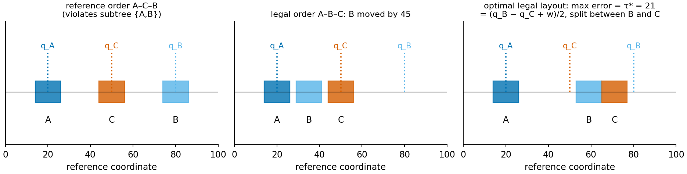
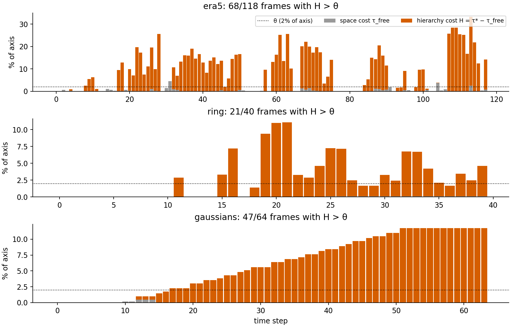
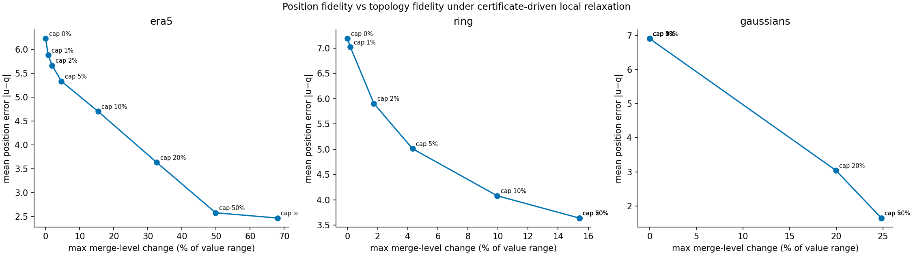
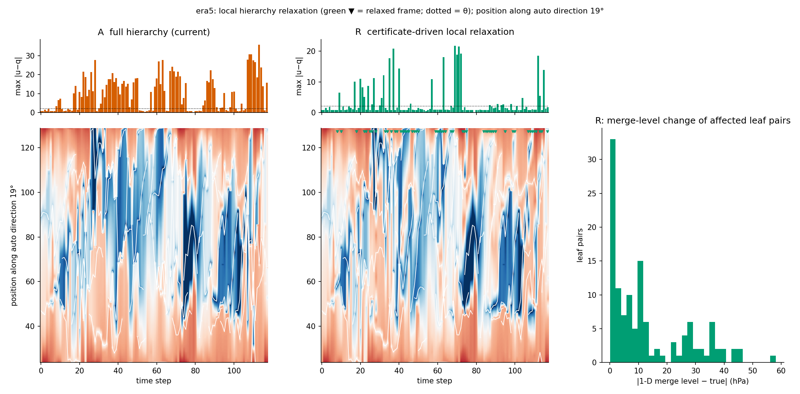
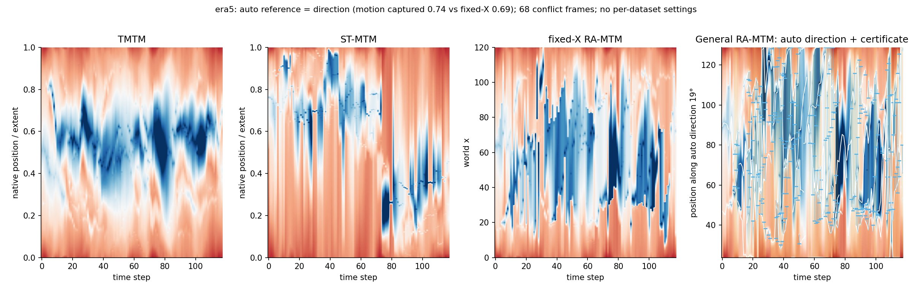
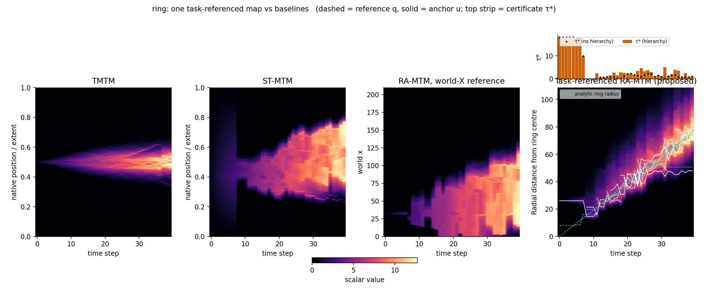

# 合并树图能有多忠实？时变标量场静态可视化中可证明的位置–拓扑权衡

**How Faithful Can a Merge Tree Map Be? Certified Position–Topology Trade-offs in Static Visualizations of Time-Varying Scalar Fields**

> **草稿 v0.1（中文），2026-09-26。** 目标会议：PacificVis 2027 Conference Paper Track（正文 9 页 + 2 页参考文献）。
> 本稿依据 [notes/paper-outline.md](../notes/paper-outline.md) 撰写。文中数字均来自已完成的原型实验（`prototypes/output/*.json`）。
> **【待补】** 标出尚缺的实验、证明或图，汇总见文末附录 A。
> ERA5 结果使用 ARCO-ERA5 的 12 小时子集；它与合作者 CDS 原始文件提取出的特征、层次和极值完全一致，但**投稿前须用 CDS 原文件重跑**。
> 图目前均为原型图，定稿前统一重绘。

---

## 摘要

合并树图（merge tree map）把时变标量场的每个时刻线性化为一列一维像素，同时保持该时刻的合并树，从而在一张静态图中展示全部时间演化。然而，二维空间压缩为一维不可避免地引入位置失真，现有方法既不度量、也不报告这种失真。

本文研究：**保持合并树的一维图最多能在多大程度上忠实于空间参考坐标？** 我们把合并树图形式化为满足层次约束的一维区间布局，并证明对每个时刻都可以精确计算一个下界 τ\*：任何保持合并树子树连续、宽度正比于特征测度的布局，其最大位置偏差都不可能低于 τ\*。我们进一步把 τ\* 分解为由层次约束造成的部分和由空间容量造成的部分。

在此基础上，我们提出由证书驱动的局部层次放松：按合并持久性从弱到强解除子树连续约束，用带标签交错距离（labeled interleaving distance）度量由此造成的拓扑失真，从而得到位置–拓扑权衡曲线。

在 ERA5 海平面气压数据上：58% 的时刻存在超过可辨阈值的层次冲突，最大可达轴长的 31%；若要把平均位置误差降低 42%，需要付出最高 27.8 hPa 的合并层级失真（减半则需 28–43 hPa），而在可辨阈值（约 1.7 hPa）内只能降低 9%。该下界使合并树图的几何忠实度第一次变得可证明，并揭示了整个基于拓扑的静态图方法族所面临的根本权衡。

**关键词**：合并树；时变标量场；静态可视化；线性化；布局优化；忠实度；交错距离

---

## 1 引言

地球科学、流体力学、燃烧模拟等领域大量产生时变标量场。动画是检查这类数据最直观的方式，但它是瞬时的：观察者必须记住先前的帧才能比较，短暂的事件容易被错过，也无法打印或并排比较 [1, 2]。**静态时空图**把时间放在一个轴上、把空间压缩到另一个轴上，是动画的重要补充。经典的 Hovmöller 图 [5] 沿固定经线或纬线聚合；空间填充曲线方法 [3, 4] 把全部样本排成一维序列，但会把单个特征打散。

**合并树图**是这一方向上的新进展。Temporal Merge Tree Maps（TMTM）[1] 借助增广合并树对每个时刻做深度优先线性化，使一维函数与原场具有相同的合并树，即特征不会被打散，同时保留全部样本作为上下文。Spatiotemporal Merge Tree Maps（ST-MTM）[2] 进一步在合并树约束下优化叶子之间的距离，使空间上相近的特征在一维中也相近。

然而，**二维空间压到一维必然失真**。ST-MTM 自己也指出，没有任何一维顺序能同时保持三个以上特征的全部两两距离，压缩一处必然拉伸另一处 [2, §7]。更根本的是，**合并树要求同一子树的叶子在一维中连续，而这一要求会与空间位置直接冲突**：若两个低压属于同一个低压槽（在合并树中先合并），而第三个不属于该槽的低压在地理上恰好位于二者之间，那么任何保持合并树的一维布局都必须把其中某个低压画到错误的位置上（图 3）。

现有方法各自优化某个目标，却都**不报告**失真有多大、发生在哪里。读者看到两条色带在图中靠近，无法判断这是真实的接近，还是布局强加的假象。

> *Every merge tree map misrepresents space somewhere; none of them says where, or by how much.*

**研究问题。** 本文回答：**保持合并树的一维图最多能在多大程度上忠实于空间参考坐标？其不忠实的部分能否被证明、定位和控制？**

我们的思路与 Meulemans 的主张 [25] 一致：可视化的质量必须先被明确定义，才能被度量和保证。为此，本文不再提出"又一个更好的布局"，而是给出一个**可证明的界**和一个**可控的权衡**。

**贡献。**

1. **忠实度模型**（§4）：把 TMTM、ST-MTM 与参考锚定变体统一建模为满足层次约束的一维区间布局，区分拓扑、位置、大小三种忠实度，并指出各方法在这一空间中的位置。
2. **偏差证书**（§5）：对每个时刻给出保持合并树的布局所能达到的最小最大位置偏差 τ\*；证明它可以精确求解，且在固定叶序下有闭式解；并将其分解为层次代价与空间代价。
3. **可控的位置–拓扑权衡**（§6）：由证书触发、按持久性顺序的局部层次放松；证明渲染后一维图的合并层级失真等于带标签交错距离；得到权衡曲线。默认设置不需要按数据集设定参数。
4. **实证刻画**（§7–8）：在 ERA5 与两个合成数据上量化冲突的普遍性与代价，并据此为整个方法族给出设计建议。

---

## 2 相关工作

**时变场的静态可视化。**
- Hovmöller 图 [5] 与热带气旋研究中的径向–时间图，沿固定参考坐标展示时间演化，但对另一维做了聚合或切片，因此会把不同特征合并在一起。
- 空间填充曲线方法 [3, 4] 为二维或三维数据提供紧凑的一维序列，但不保持特征完整性 [1]。
- 拓扑景观 [6] 构造与原场拓扑等价的二维地形；保几何的拓扑景观 [7] 在此基础上引入特征之间的几何邻近，并支持同一定义域上多个函数的比较。
- 合并树图 [1, 2] 在一维中保持合并树，并用时间轴连接各帧。

上述工作都没有给出**层次约束下几何失真的下界**。

**运动与区域的一维摘要。**
- MotionRugs [8] 把每个时刻的实体排成一维序列；Stable Visual Summaries [9] 把排序改为投影到平滑变化的主方向。
- MoReVis [11] 通过布局优化，使标记的大小与位置接近原始空间。
- 与本文最相近的是同在 PacificVis 发表的 **GroupRugs** [10]：它让群组在一维中占据连续的像素带，同时兼顾空间质量与稳定性。但它衡量的是基于邻域的**排序**质量，群组是扁平的，也没有给出冲突的下界。
- Rauscher 等人 [12, 13] 评估一维排序的邻域失真，并在图中用阴影线、光晕等标示伪影。

本文面向标量场的合并树，处理**带合并层级的嵌套层次**与**度量意义上的位置**，并给出可证明的下界。

**带约束的一维放置与排序。**
- Li 与 Wang [14] 给出了区间在直线上最小最大位移分离的 O(n log n) 最优算法，顺序可任意。它正是本文在去掉层次约束后的特例（τ_free，§5.3），只是我们另外加了画布与 anchor 偏心约束。
- IPSep-CoLa [15] 用分离约束的二次规划做布局，与我们第二阶段的优化同类。
- 最优叶序 [16] 在树允许的叶序上做动态规划。地理系统发育图 [17]、按外部顺序重排树 [18] 与位移最优的 tanglegram [19] 研究树约束下的叶序，但目标是交叉数、逆序数或位移之和，不涉及带宽度的最小最大下界。
- 一维尺度化本身是 NP-hard [39]。

**权衡与忠实度。**
- 面积变形地图需要权衡面积、形状与拓扑误差 [22]；数据–空间网格图 [21] 在空间布局与数据布局之间渐变，是"权衡导航"最接近的先例。
- 空间有序树图 [20] 度量层次布局中的位置一致性，并画出位移向量。
- 投影失真可视化 [23] 把降维误差直接画在图上。
- Kindlmann 与 Scheidegger [24] 把数据与视觉的对应关系表述为设计原则。

**合并树距离。**
- 交错距离 [26] 是比较合并树的基本度量。Munch 与 Stefanou [27] 证明，带标签合并树的 ℓ∞-cophenetic 度量就是一种交错距离；Gasparovic 等人 [28] 给出其 O(n²) 计算；Yan 等人 [29] 将其用于时变数据的几何感知比较；ParkView [30] 可视化单调交错。

据我们所知，**交错距离此前没有被用于评估线性化或布局**。

> *No prior work bounds the positional distortion forced by hierarchy constraints in 1-D layouts, nor quantifies the position–topology trade-off for merge tree maps.*

---

## 3 背景：合并树图

**增广合并树。**
- 设 f_t: Ω → ℝ 为第 t 个时刻的标量场（Ω ⊂ ℝ²，t = 1, …, T）。随等值 α 递增，下水平集的连通分量在局部极小处出生、在鞍点合并，由此得到 join tree；对上水平集做同样的记录得到 split tree，二者统称合并树 T_t [1]。
- 增广合并树把全部采样点作为普通结点挂在对应的超弧上。
- 每个叶子 ℓ 对应一个特征：其叶弧所覆盖的区域，测度（面积）为 A_ℓ，极值点位置为 R_ℓ。两个叶子 i、j 的合并值为 f(lca(i, j))。
- 本文对 ERA5 使用 join tree（低压为叶），对 Ring 与 Gaussian 使用 split tree。多重鞍点按惯例二叉化。

**共同流程。** 三类合并树图都遵循"树 → 叶序 → 区间 → 填充 → 按时间堆叠"的流程：

- **TMTM** [1]：深度优先遍历，每个子树分到与其样本数成正比的一段区间（**绝对**大小）。可以证明，输出的一维函数与原场具有相同的合并树（Merge Tree Identity）。子树顺序用贪心法与相邻帧对齐。
- **ST-MTM** [2]：先用最优叶序确定顺序，再最小化加权 stress 确定叶子的 anchor；宽度按 σ^α 分配，总和固定为 K（**相对**大小）；最后用叶弧采样与最近公共祖先（LCA）路径填充空隙。
- **参考锚定变体**（合作者先前工作）：引入固定的世界参考坐标 q，用"先线性规划求最小偏差、再在预算内做二次规划"的两阶段方法求解。

本文沿用 ST-MTM 的填充方法 [2]，**不将其作为贡献**。

---

## 4 合并树图的忠实度模型

### 4.1 作为层次约束区间布局的合并树图

设某时刻的合并树 T 有 n 个叶子。一个布局由三部分组成：
- 叶序 π；
- 每个叶子的区间中心 z_i 与宽度 w_i；
- 叶子极值在一维中的放置位置 u_i（anchor）。

约束如下，其中 a 为画布起点、L 为画布长度、g 为最小间距、ρ ∈ [0, 1]：

- **层次（H）**：π ∈ Π(T)，即 T 的每个子树的叶子在 π 中连续。|Π(T)| = ∏_v deg(v)!，乘积取遍所有内部结点。
- **大小（S）**：w_i = c·A_i，比例系数 c 对全部时刻相同。
- **分离（D）**：沿 π 相邻的两个叶子满足 z_{π(k+1)} − z_{π(k)} ≥ (w_{π(k)} + w_{π(k+1)})/2 + g。
- **画布（C）**：a + w_i/2 ≤ z_i ≤ a + L − w_i/2。
- **偏心（E）**：|u_i − z_i| ≤ ρ·w_i/2，即极值放在自己的区间内。

### 4.2 三种忠实度

- **拓扑忠实**：渲染后的一维函数与 T 具有相同的带标签合并树。
- **位置忠实**：给定参考坐标 φ: Ω → ℝ 与 q_i = φ(R_i)，位置偏差为 e_i = u_i − q_i。
- **大小忠实**：宽度正比于测度，且比例跨时刻固定，使不同时刻的特征大小可以直接比较。

> *Existing methods fix one fidelity and optimize another without measuring the third.*

### 4.3 已有方法在模型中的位置

| 方法 | 拓扑 | 位置 | 大小 |
|---|---|---|---|
| TMTM [1] | 保持（定理） | 不控制 | 绝对（样本数） |
| ST-MTM [2] | 保持（沿用 [1] 的填充） | 相对距离（stress），没有参考坐标 | 相对（总和 K） |
| 参考锚定变体 | 保持 | 参考坐标，在预算内优化 | 绝对（c·A） |
| **本文** | 默认保持；可控放松，并**度量**失真 | 参考坐标 + **可证明下界** | 绝对（c·A） |

**【待补】图 2**：左为共同流程示意，右为三种忠实度 × 方法的定位图。

### 4.4 冲突为何不可避免

考虑合并树 ((A, B), C)，参考值 q_A = 20、q_C = 50、q_B = 80，三个区间宽度均为 w = 12（图 3）。

- 按参考值排序得到 A–C–B，但它拆开了子树 {A, B}，不合法。
- 合法叶序只有 A–B–C、B–A–C、C–A–B、C–B–A 四种。
- 以 A–B–C 为例，B 必须位于 C 左侧至少 w 处，于是 B 与 C 至少有一个偏离参考 (q_B − q_C + w)/2 = 21。

由命题 2 可以精确验证：该例的最小最大偏差为 **τ\* = 21**，由 A–B–C 与 C–A–B 两个叶序同时取到。

**图 3**　三叶冲突示例。左：按参考值排序会拆开子树 {A, B}；中：一个合法但偏差很大的布局；右：最优合法布局，最大偏差 τ\* = 21，由 B 与 C 平分。

**问题随之而来：在一般情形下，保持合并树所需付出的最小位置偏差是多少？**

---

## 5 位置失真的证书

### 5.1 证书 τ\*

**定义 1。** 对合并树 T 与参考值 q，定义

  τ\*(T) = min { max_i |u_i − q_i| : (π, z, u) 满足 (H)(S)(D)(C)(E) }。

**命题 1（可精确求解）。** 固定 π 后，可行集是关于 (z, u, τ) 的凸多面体，τ(π) 是一个线性规划的最优值。因此

  τ\*(T) = min_{π ∈ Π(T)} τ(π)

在模型约束下是**精确**最小值，不是启发式估计。

*证明概要*：约束 (D)(C)(E) 与 |u_i − q_i| ≤ τ 都是线性的；Π(T) 是有限集。□ **【待补：正式证明写入补充材料】**

### 5.2 固定叶序的闭式解

令 h_i = ρ·w_i/2。沿 π 记：
- D_k = Σ_{m<k} w_m + w_k/2 + (k−1)·g，为画布起点到第 k 个区间中心所需的最小距离；
- E_k 为第 k 个区间中心到画布终点所需的最小距离（对称定义）；
- S_{ij} = D_j − D_i。

**命题 2（闭式解）。** 若 Σ w_i + (n−1)·g ≤ L，则

  τ(π) = max{ 0,
    max_{i<j} (q_i − q_j + S_{ij} − h_i − h_j) / 2,
    max_k (a + D_k − q_k − h_k),
    max_k (q_k − h_k − (a + L − E_k)) }；

否则不可行。

*证明概要*：
1. 消去 u 后，|u_k − q_k| ≤ τ 与 (E) 同时可满足，当且仅当 |z_k − q_k| ≤ τ + h_k。于是每个 z_k 落在一个盒窗口 [lo_k, hi_k] 内。
2. 带下界分离约束的链，其最早放置为 z_j = max_{i ≤ j}(lo_i + S_{ij})；可行当且仅当对所有 i ≤ j 有 lo_i + S_{ij} ≤ hi_j。
3. 展开 lo 与 hi 中的 max/min，即得上式三项；第四项是容量条件。□ **【待补：正式证明】**

我们在 ERA5 的抽样帧上把该闭式解与线性规划逐一比较，最大差为 2×10⁻¹⁴。在图 3 的例子上，它给出四个合法叶序的 τ 分别为 21、36、21、36。每个叶序的计算量为 O(n²)，便于批量枚举。

### 5.3 归因：层次代价与空间代价

**定义 2。** 令 τ_free 为去掉层次约束 (H)、允许任意叶序时的同一问题的最优值。定义层次代价

  H = τ\* − τ_free，

空间代价为 τ_free（来自宽度、间距、画布与偏心约束）。

**命题 3（单调性与分解）。**
(i) τ_free ≤ τ\*，从而 H ≥ 0。
(ii) 记 flatten(T, v) 为把非根内部结点 v 的子结点并入其父结点所得的树，则 Π(T) ⊆ Π(flatten(T, v))，从而 τ\*(flatten(T, v)) ≤ τ\*(T)。
(iii) 展平全部内部结点后得到星形树，其 τ\* 等于 τ_free。

*证明*：(ii) 中，T 的任一合法叶序在展平后仍然合法（保持原来的相邻顺序即可）；可行集变大，最优值不增。(i)、(iii) 由 (ii) 反复应用得到。□

> *H is exactly the price of keeping every subtree contiguous.*

当 n ≤ 6 时，τ_free 通过枚举全部排列精确求得；否则取按 q 排序并做相邻交换爬山得到的上界。在 ERA5 的 118 帧中，109 帧为精确值。**【待补】** 实现 Li–Wang 算法 [14]，并在其中加入画布与偏心约束，使 τ_free 在所有帧上都精确。

### 5.4 算法与复杂度

**算法 1（证书）**：对每个时刻
1. 枚举 Π(T)，用命题 2 计算每个 τ(π)；取最小值得到 τ\*，并用同样方法计算 τ_free，得到 H。
2. 在预算 τ\* + Δ 内，对候选叶序求解合作者的第二阶段二次规划（参考误差 + 几何 stress + 运动残差 + 偏心项），得到实际布局 (π, z, u)。
3. 输出 τ\*、H，以及实际偏差 e。

复杂度为 O(|Π(T)|·n²)。在 ERA5 上，每帧叶子数为 1–11，合法叶序数的中位数为 16、最大为 1024（表 1），可以直接枚举。多项式时间的树上算法仍是开放问题（§8）。

### 5.5 参考坐标与常数的选取

为避免按数据集调参，本文的默认设置由两条统一规则确定：

**参考坐标。** 默认取**追踪到的特征位移的主方向**，即位移散布矩阵的主特征向量，符号取为平均运动为正的方向。这一选择与坐标轴的摆放无关。它在三个数据集上捕获的运动比例分别为：

| 数据集 | 自动方向 | 固定 x | 固定 y |
|---|---|---|---|
| ERA5（19°，东北偏东） | **0.74** | 0.69 | 0.31 |
| Ring | **0.66** | 0.46 | 0.54 |
| Gaussian | **0.70** | 0.59 | 0.41 |

用户也可以指定其他参考，例如径向距离或到焦点特征的距离。但我们发现，从追踪到的极值运动中自动估计径向中心并不可靠：在 Ring 上，真实中心只解释了追踪运动的 7%。因此径向参考不作为默认。

**常数。** 设轴长为 L：
- 宽度比例使整个定义域面积对应半个轴长；
- g = L/240，Δ = L/120，ρ = 0.5；
- 可辨阈值 θ = 0.02·L。θ 是唯一的全局常数，对所有数据集相同，对应于读者在公共尺度上判断位置的精度量级。

---

## 6 位置–拓扑权衡的导航

### 6.1 证书驱动的局部放松

证书告诉我们何时、多大程度上是层次约束迫使图偏离了位置。若读者更看重位置，可以有选择地放松层次。

**规则**（仅在 H > θ 的时刻执行）：
1. 在所有非根内部结点中，找出展平后能使 τ\* 下降的结点；
2. 从中选择合并最弱的一个，即 |f(v) − f(parent(v))| 最小者，按持久性顺序；将其展平；
3. 重复，直到 H ≤ θ，或没有结点能再降低 τ\*。

与持久性简化 [35] 不同，这一规则**不修改数据**，只放松布局约束。

展平 v 之后，v 的叶子可以与原先的"叔伯"子树交错排列。这样一来，它们在一维中只能在父结点的层级相遇，图上显示的合并值从 f(v) 变为 f(parent(v))。

**【待补】图 5**：展平一个结点前后的树、一维列与合并层级变化。

### 6.2 拓扑代价的度量

设 g 为渲染后的一维列，a_i 为叶子 i 的 anchor 像素。一维中 i 与 j 的合并层级为
- join tree：m_g(i, j) = max_{x ∈ [a_i, a_j]} g(x)；
- split tree：取 min。

原因是在一维中，连接两点的路径是唯一的。定义

  d_top(g, T) = max_{i<j} | m_g(i, j) − f(lca_T(i, j)) |。

**命题 4。** 若 g 的合并树与 T 具有相同的带标签叶集，且叶子值相等（填充时 anchor 处放置的就是叶子极值），则 d_top 等于二者 cophenetic 向量的 ℓ∞ 距离，即带标签交错距离 [27, 28]。

*证明概要*：一维中叶对的合并层级就是 g 的合并树中二者最近公共祖先的值；对角项（叶子值）相等；再由 [27] 的等价定理即得。□ **【待补：正式证明】**

命题 4 的前提在实验中成立：ERA5 上全部 51 个放松帧中，渲染后一维列的叶子数都与原合并树相同，没有产生伪极值。未放松的帧逐帧满足合并树签名相等，d_top = 0。

### 6.3 权衡曲线与用户控制

对单次展平允许的合并层级改变设定上限 κ（占值域的比例），并从 0 扫描到 ∞，即得到曲线：d_top 对应平均位置误差。

- **默认 κ = 0**：保持拓扑，并用证书披露偏差。
- κ 作为用户在分析时**显式选择**的滑块，而不是按数据集调节的参数。

当前实现中 κ 约束的是单步；连续展平会累积，实际 d_top 可能超过 κ（例如 ERA5 上 κ = 10% 时，实际为值域的 15%）。**【待补】** 改为按累积量约束。

### 6.4 视觉编码

- **证书强度带**：在图的上方，按列绘制 τ\* 与 H。
- **放松标记**：被放松的合并在断开处加标记，借鉴 ParkView [30] 对交错的可视化。

我们**不**采用逐特征的"真实位置刻度"：它在合成场景中有效，但在 ERA5 上每 118 帧会产生 332 个刻度，图面不可读（附录 B）。**【待补】** 实现以上编码并重绘图 1 与图 8。

---

## 7 评估

围绕三个研究问题展开：
- **RQ1**：层次冲突有多普遍？
- **RQ2**：降低位置误差需要付出多少拓扑代价？
- **RQ3**：证书对现有方法揭示了什么？

### 7.1 实验设置

**表 1**　数据集与证书统计（θ = 2% 轴长；参考为自动方向）

| 数据集 | 类型 | 帧 | 叶子/帧 | 合法叶序（中位/最大） | 轨迹数 | 冲突帧（H > θ） | 最大 H（占轴长） | 冲突帧中位 H（占轴长） | 最大空间代价（占轴长） |
|---|---|---|---|---|---|---|---|---|---|
| Gaussian（复刻 [2] 的动机场景） | split，64×64 | 64 | 3–4 | 4 / 8 | 4 | 47（73%） | 11.8% | 8.4% | 0.5% |
| Ring [1, 3] | split，14×14 | 40 | 1–7 | 16 / 64 | 19 | 21（53%） | 11.1% | 4.1% | 0.1% |
| ERA5 MSLP，欧洲，1999-11-17 至 2000-01-14，每 12 h | join，49×49 | 118 | 1–11 | 16 / 1024 | 143 | **68（58%）** | **30.8%** | 13.9% | 4.6% |

**说明：**
- ERA5 的预处理完全沿用合作者的协议：等积投影、250 km 高斯平滑、49×49 重采样、支撑重叠的 Hungarian 匹配。
- 冲突帧的"中位 H"只统计 H > θ 的帧。
- Gaussian 场景：两个静止的高斯斑 l1、l2 由脊相连，第三个斑 l3 从 l2 附近移动到与二者等距的位置；约 t = 13 之后，d(l3, l1) < d(l2, l1)。

**基线**：TMTM [1]、ST-MTM [2]、固定 x 轴的参考锚定图。所有方法共享同一套合并树、支撑区域与特征对应。

**正确性检查**（所有实验均通过）：
- 叶序对（放松后的）层次合法；
- 宽度 = c·A；
- 间距、画布、偏心约束满足；
- 实际偏差不超过预算；
- 未放松的帧，渲染后的合并树签名与原树相同。

### 7.2 RQ1：层次冲突有多普遍？

图 4 按帧给出空间代价 τ_free 与层次代价 H。

**图 4**　逐帧的空间代价（灰）与层次代价（橙），以轴长百分比表示；虚线为 θ。

三点观察：

1. **在真实天气数据上，冲突是常态而非例外。** ERA5 中 58% 的帧 H > θ，冲突帧的 H 中位数为轴长的 13.9%，最大为 30.8%。
2. **失真几乎全部来自层次，而非空间容量。** ERA5 上空间代价最大仅为轴长的 4.6%，只有 3 帧超过 θ。
3. **冲突在时间上成段出现**，对应天气系统在低压槽内合并、分裂的时期。**【待补：与 7.5 的案例对应】**

这一现象不依赖于我们的参考选择：在合作者原先的协议中（CDS 原始数据、固定 x 轴参考、画布 120），最坏帧的证书同样达到 τ = 33.8，即轴长的 28%。

> *Hierarchy-induced conflicts are the norm, not the exception, on real weather data.*

**【待补：稳健性】** 对 θ ∈ {1, 2, 5}%、参考方向（自动 / x / y / 8 个角度）、时间间隔（6 h / 12 h）与持久性简化阈值做扫描，报告冲突比例的区间。

### 7.3 RQ2：降低位置误差需要多少拓扑代价？

图 6 与表 2 给出三个数据集的权衡曲线。

**图 6**　位置–拓扑权衡：横轴为最大合并层级改变（d_top，占值域百分比），纵轴为平均位置误差；各点对应单步上限 κ。

**表 2**　不同 κ 下的结果（位置误差单位为参考坐标单位；ERA5 的 d_top 单位为 hPa）

| 数据集 | κ | 放松帧 | 平均误差 | p95 | 最大 | 误差 > θ 的帧 | 合并层级改变的叶对 | 最大 d_top | 拓扑完全精确的帧 |
|---|---|---|---|---|---|---|---|---|---|
| ERA5 | 0（保拓扑） | 0 | 6.23 | 20.8 | 35.8 | 77 | 0% | 0 | 118/118 |
| ERA5 | 2% | 14 | 5.67（−9%） | 18.4 | 30.7 | 74 | 2.2% | 1.6 hPa | 104 |
| ERA5 | 5% | 20 | 5.33（−14%） | 17.6 | 27.7 | 70 | 3.2% | 4.0 hPa | 98 |
| ERA5 | 20% | 41 | 3.63（−42%） | 15.0 | 21.8 | 50 | 7.6% | 27.8 hPa | 77 |
| ERA5 | ∞ | 51 | 2.47（−60%） | 11.4 | 21.8 | 32 | 10.0% | 58.1 hPa | 67 |
| Ring | 0 | 0 | 7.19 | 23.0 | 35.1 | 25 | 0% | 0 | 40/40 |
| Ring | 2% | 6 | 5.91（−18%） | 15.7 | 33.7 | 24 | 2.9% | 0.22（值域 1.8%） | 34 |
| Ring | ∞ | 15 | 3.64（−49%） | 8.8 | 14.3 | 17 | 12.1% | 1.96（值域 15%） | 25 |
| Gaussian | ≤ 10% | 0 | 6.91 | 20.0 | 20.0 | 49 | 0% | 0 | 64/64 |
| Gaussian | ∞ | 47 | 1.65（−76%） | 4.3 | 4.3 | 17 | 26.5% | 0.37（值域 25%） | 17 |

**观察：**

1. **在可辨阈值内，放松带来的收益很小。** ERA5 在 κ = 2%（约 1.7 hPa）时平均误差仅降低 9%；要降低 42%，需要容忍 27.8 hPa 的合并层级改变。不设限时误差降低 60%，但有 10% 的叶对合并层级改变，平均 13.0 hPa，最大 58.1 hPa。
2. **冲突的"价格"取决于造成冲突的合并有多强。**
   - Ring 的冲突来自环上几个极大值之间的浅鞍点，在 κ = 2% 时就能降低 18%。
   - Gaussian 的冲突来自 l1–l2 之间的强脊，约占值域的 20% 以上，κ < 20% 时完全无法放松。
   - ERA5 介于二者之间，但主要冲突来自持久性高的鞍点。
3. 放松后仍有 19 个 ERA5 帧的 H > θ：放松只能展平结点，无法消除空间代价，而且贪心顺序并不保证全局最优（§8）。

> *On ERA5, reducing the mean positional error of a merge tree map by 42% costs merge-level distortion of up to 27.8 hPa; within a legible 2% budget, only 9% of the error can be removed.*

**图 7**　ERA5：保持完整层次（左）与不设限的局部放松（中）。上方柱状为各帧最大偏差，虚线为 θ；右侧为受影响叶对的合并层级改变分布（原型图，待重绘）。

### 7.4 RQ3：证书对现有方法揭示了什么？

图 8 在同一段 ERA5 上并排展示 TMTM、ST-MTM、固定 x 轴参考图，以及本文默认设置（自动方向 + 证书）。

**图 8**　ERA5 上的四种合并树图（原型图）。最右为本文方法：自动方向 19°，冲突帧用浅色底纹标出。当前版本逐特征的刻度过密，定稿时改为证书强度带（§6.4）。

**作为背景，合作者原协议（CDS 原始数据）中的指标：**

| 方法 | x 参考偏差（NMAE） | SNS↓ | TW↑ | 最坏帧 τ |
|---|---|---|---|---|
| TMTM | 0.277 | 0.149 | 0.804 | – |
| ST-MTM | 0.656 | **0.078** | **0.876** | – |
| 固定 x 参考锚定 | **0.054** | 0.226 | 0.721 | 33.8（画布 120） |

**说明：**
- TMTM 与 ST-MTM 并不以参考坐标为目标，它们的"x 参考偏差"是在原生坐标下测得的，只能说明它们不编码位置。
- ST-MTM 在相对几何（SNS、TW）上最好，这与它的设计目标一致。本文**不主张**在所有指标上优于它。

**关键点：**
- TMTM 的宽度同样正比于样本数（绝对大小），因此本文的证书可以直接用于 TMTM 的宽度模型：**任何**满足该宽度模型的保合并树布局，都至少有 τ\* 的位置偏差。
- **【待补】** 在 TMTM 与 ST-MTM 各自的宽度模型下计算 τ\*；对二者做仿射校准后测量实际位置误差，报告"实际误差 / τ\*"，量化现有方法离可达下界有多远。

### 7.5 案例：1999 年 12 月欧洲风暴

**【待补】** 围绕 Anatol（12 月 3 日）、Lothar（12 月 26 日）与 Martin（12 月 27 日）展开：
- 证书在哪些时段报警（对应图 4 中 t ≈ 105–115 的高冲突段）；
- 放松改变了哪些合并，以及这些改变在气象上是否合理。

**谨慎表述**：叶极小值不等同于经过验证的气旋中心；特征对应只是支撑区域的重叠。

### 7.6 运行时间

**表 3**　端到端时间（Apple M4 Pro Mac mini，单线程 Python）

| 数据集 | 自动参考 + 证书 + 两次渲染 | 证书 + 放松 + 两次渲染 |
|---|---|---|
| ERA5（118 帧） | 10.7 s | 9.2 s |
| Ring（40 帧） | 3.5 s | 3.3 s |
| Gaussian（64 帧） | 0.6 s | 0.6 s |

**【待补】** 拆分每帧的闭式解、LP、QP 与渲染时间；报告合法叶序数与耗时的关系。

---

## 8 讨论

**对方法族的启示。** 实验表明，在真实天气数据上，一维图的"位置忠实"与"合并树忠实"不可兼得。这一结论适用于 TMTM、ST-MTM 与任何保持合并树的一维布局，而不是某个实现的缺陷。由此我们提出三条设计建议：

1. **默认保持拓扑，同时披露位置偏差**：证书强度带让读者知道哪些时段的位置不可信；
2. **需要位置时，显式放松层次并展示代价**：由用户沿权衡曲线选择 κ；
3. **比较新的布局方法时，报告"实际误差 / τ\*"**，而不只报告指标高低。

**局限。**
1. 证书依赖对合法叶序的枚举，适用于每帧约 12 个叶子以内的树；更大的树需要持久性简化或多项式算法。
2. 贪心放松不保证到达帕累托前沿；κ 目前只约束单步。
3. 参考坐标为单一方向，只捕获部分运动（ERA5 上为 0.74）；自动径向中心不可靠。
4. 特征对应基于支撑重叠，极值会因网格采样而跳变。
5. ERA5 为 12 小时间隔的子集。
6. 没有进行用户实验。
7. θ 是一个全局常数，其取值依据是位置判断精度的量级，而不是针对本文数据的实验标定。

我们报告两个未能推广的设计：
- 让运动特征承担偏差的"稳定性优先"策略，在 Ring 和 ERA5 上反而增加了虚假运动；
- 逐特征的真实位置刻度，在 ERA5 上不可读。

**未来工作。**
- 带宽度与目标窗口的树上多项式算法；
- 精确的多目标放松；
- 面向读图任务的用户实验；
- 三维数据与多变量场。

---

## 9 结论

我们研究了保持合并树的一维静态图最多能有多忠实于空间位置。通过把合并树图形式化为层次约束下的区间布局，我们给出了每个时刻都可以精确计算的偏差证书 τ\*，并把它分解为层次代价与空间代价；再通过证书驱动的局部放松与带标签交错距离，刻画了位置与拓扑之间的权衡。

在 ERA5 上，层次冲突出现在 58% 的时刻，把平均位置误差降低 42% 需要最高 27.8 hPa 的合并层级失真，而在可辨范围内只能降低 9%。这些结果使合并树图的几何忠实度第一次变得可证明，也为今后的静态时空可视化给出了一个明确的比较基准。

---

## 参考文献

**【待补：全部条目需经 `/aris:citation-audit` 核查；标 ◆ 者为预印本或会议论文集，标 ? 者作者或卷期信息待核】**

1. W. Köpp, T. Weinkauf. Temporal Merge Tree Maps: A Topology-Based Static Visualization for Temporal Scalar Data. *IEEE TVCG* 29(1):1157–1167, 2023.
2. ? Spatiotemporal Merge Tree Maps: A Topology and Geometry Aware Visualization for Temporal Scalar Data. Preprint (SSRN 6604235), submitted to *Computers & Graphics*, 2026. ◆
3. M. Franke, H. Martin, S. Koch, K. Kurzhals. Visual Analysis of Spatio-temporal Phenomena with 1D Projections. *CGF* 40(3):335–347, 2021.
4. L. Zhou, C. R. Johnson, D. Weiskopf. Data-Driven Space-Filling Curves. *IEEE TVCG* 27(2):1591–1600, 2021.
5. ? E. Hovmöller. The Trough-and-Ridge Diagram. *Tellus* 1(2), 1949.
6. G. H. Weber, P.-T. Bremer, V. Pascucci. Topological Landscapes: A Terrain Metaphor for Scientific Data. *IEEE TVCG* 13(6), 2007.
7. K. Beketayev, G. H. Weber, D. Morozov, A. Abzhanov, B. Hamann. Geometry-Preserving Topological Landscapes. *Proc. WASA (SIGGRAPH Asia Workshop)*, 155–160, 2012.
8. J. Buchmüller et al. MotionRugs: Visualizing Collective Trends in Space and Time. *IEEE TVCG*, 2019. ?
9. J. Wulms et al. Stable Visual Summaries for Trajectory Collections. *Proc. IEEE PacificVis*, 2021. ?
10. M. C. A. Stolk, J. J. H. M. Wulms, K. A. B. Verbeek. GroupRugs: Visual Summaries for Groups in Collective Movement Data. *Proc. IEEE PacificVis*, 128–137, 2025.
11. G. Valdrighi et al. MoReVis: A Visual Summary for Spatiotemporal Moving Regions. *IEEE TVCG* 30(4), 2024. ?
12. J. Rauscher et al. Visually Assessing 1-D Orderings of Contiguous Spatial Polygons. *CGF* 44, 2025.
13. J. Rauscher, F. L. Dennig, U. Schlegel, D. A. Keim, T. Schreck. Visual Boosting Techniques for Spatiotemporal Dense Pixel Visualizations. *EuroVA* 2026 / arXiv:2604.25298. ◆
14. S. Li, H. Wang. Separating Overlapped Intervals on a Line. *Journal of Computational Geometry* 10(1):281–321, 2019.
15. T. Dwyer, Y. Koren, K. Marriott. IPSep-CoLa: An Incremental Procedure for Separation Constraint Layout of Graphs. *IEEE TVCG* 12(5):821–828, 2006.
16. Z. Bar-Joseph, D. K. Gifford, T. S. Jaakkola. Fast Optimal Leaf Ordering for Hierarchical Clustering. *Bioinformatics* 17(Suppl 1):S22–S29, 2001.
17. J. Klawitter et al. Visualizing Geophylogenies — Internal and External Labeling with Phylogenetic Tree Constraints. *GIScience* 2023; *JGAA* 29(1), 2025.
18. L. Bulteau, P. Gambette, O. Seminck. Reordering a Tree According to an Order on Its Leaves. *CPM* 2022. ◆
19. D. H. Huson. Displacement-Optimized Tanglegrams for Trees and Networks. *Molecular Biology and Evolution* 43(3), 2026.
20. J. Wood, J. Dykes. Spatially Ordered Treemaps. *IEEE TVCG* 14(6):1348–1355, 2008.
21. N. van Beusekom, W. Meulemans, B. Speckmann, J. Wood. Data-Spatial Layouts for Grid Maps. *GIScience* 2023, LIPIcs 277:10. ◆
22. S. Nusrat, S. Kobourov. The State of the Art in Cartograms. *CGF* 35(3), 2016.
23. M. Aupetit. Visualizing Distortions and Recovering Topology in Continuous Projection Techniques. *Neurocomputing* 70, 2007. ?
24. G. Kindlmann, C. Scheidegger. An Algebraic Process for Visualization Design. *IEEE TVCG* 20(12), 2014.
25. W. Meulemans. An Algorithmic Perspective on Information Visualization. arXiv:2607.29360, 2026. ◆
26. D. Morozov, K. Beketayev, G. H. Weber. Interleaving Distance between Merge Trees. *TopoInVis*, 2013. ◆
27. E. Munch, A. Stefanou. The ℓ∞-Cophenetic Metric for Phylogenetic Trees as an Interleaving Distance. In *Research in Data Science*, Springer, 2019.
28. E. Gasparovic et al. Intrinsic Interleaving Distance for Merge Trees. *La Matematica*, 2024.
29. L. Yan et al. Geometry-Aware Merge Tree Comparisons for Time-Varying Data with Interleaving Distances. *IEEE TVCG* 29(8):3489–3506, 2023.
30. ? ParkView: Visualizing Monotone Interleavings. *Proc. IEEE PacificVis*, 2025.
31. W. Köpp, T. Weinkauf. Temporal Treemaps: Static Visualization of Evolving Trees. *IEEE TVCG*, 2019.
32. J. Lukasczyk et al. Nested Tracking Graphs. *CGF* 36(3), 2017.
33. C. Heine, D. Schneider, H. Carr, G. Scheuermann. Drawing Contour Trees in the Plane. *IEEE TVCG* 17(11), 2011.
34. N. Andrienko, G. Andrienko, L. Barrett, M. Dostie, P. Henzi. Space Transformation for Understanding Group Movement. *IEEE TVCG* 19(12):2169–2178, 2013.
35. ? H. Edelsbrunner, D. Letscher, A. Zomorodian. Topological Persistence and Simplification. *Discrete & Computational Geometry* 28, 2002.
36. ? H. Hersbach et al. The ERA5 Global Reanalysis. *Q. J. R. Meteorol. Soc.* 146, 2020.
37. ? A. Dobler, M. Nöllenburg. Improving Temporal Treemaps by Minimizing Crossings. *CGF* 43, 2024.
38. ? Analyzing Time-Varying Scalar Fields using Piecewise-Linear Morse–Cerf Theory. *IEEE VIS* 2025.
39. ? M. J. Brusco, S. Stahl. Optimal Least-Squares Unidimensional Scaling. *Psychometrika*, 2005.

---

## 附录 A　待补清单（与大纲 §F 一致）

| 优先级 | 事项 | 对应章节 |
|---|---|---|
| P0 | 命题 1–4 的正式证明（补充材料） | §5、§6 |
| P0 | 稳健性扫描：θ、参考方向、时间间隔、简化阈值 | §7.2 |
| P0 | 用 CDS 原始 ERA5 重跑全部数字 | §7 |
| P0 | RQ3：在 TMTM / ST-MTM 各自的宽度模型下计算 τ\*，并用仿射读出测实际误差 | §7.4 |
| P0 | 与合作者确认定位与署名 | – |
| P1 | κ 改为按累积量约束；重画图 6、图 7 | §6.3、§7.3 |
| P1 | 证书强度带与放松标记；重绘图 1（teaser）、图 8 | §6.4、§7.4 |
| P1 | 案例：1999 年 12 月风暴 | §7.5 |
| P1 | 图 2（流程与定位）、图 5（展平示意） | §4、§6 |
| P1 | Li–Wang 算法（加画布与偏心约束），使 τ_free 全部精确 | §5.3 |
| P1 | 运行时间拆分与硬件信息 | §7.6 |
| P2 | 第二个真实数据集；专家反馈；引用核查；英文 LaTeX 版 | – |

## 附录 B　原型阶段的负面结果（可放补充材料）

- **任务参考（焦点距离）+ 逐特征真实位置刻度**：在合成场景中读数正确（`prototypes/output/gaussians_conflict_strategies.png`）；但在 ERA5 上产生 332 个刻度，不可读（图 8 右）。
- **稳定性优先**：仅在合成场景有效；在 Ring 和 ERA5 上，静止特征的虚假运动反而分别从 737 增加到 780、从 566 增加到 739（`notes/2026-09-26-general-method.md`）。
- **自动径向中心**：跟随追踪伪影；在 Ring 上，真实中心只解释追踪运动的 7%。

**图 B1**　手工指定环心时，径向参考能清楚显示 Ring 的扩张（原型图）。这说明任务参考有价值，但环心无法可靠地自动获得。
